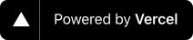
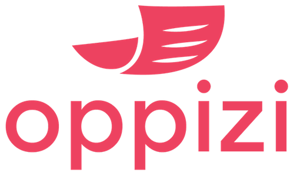

  

Welcome to the [tldraw](https://tldraw.com) monorepo.

🙌 Questions? Join the [Discord channel](https://discord.gg/SBBEVCA4PG) or start a [discussion](https://github.com/tldraw/tldraw/discussions/new).

💕 Love this project? Consider [becoming a sponsor](https://github.com/sponsors/steveruizok?frequency=recurring&sponsor=steveruizok).

Thanks to our corporate sponsors:

<a href="https://sentry.io"></img></a>

<a href="https://vercel.com/?utm_source=team-slug&utm_campaign=oss"></img></a>

<a href="https://oppizi.com"></img></a>

<a href="https://logseq.com"></img></a>

<a href="https://blindsidenetworks.com/"></img></a>

<a href="https://www.100ms.live/"></img></a>

...and to our [individual sponsors](https://github.com/sponsors/steveruizok#sponsors)!

## Contents

This repository is a monorepo containing two packages:

- [**packages/tldraw**](https://github.com/tldraw/tldraw/tree/main/packages/tldraw) contains the source for the [@tldraw/tldraw](https://www.npmjs.com/package/@tldraw/tldraw) package. This is an editor as a React component named `<Tldraw>`. You can use this package to embed the tldraw editor in any React application.
- [**packages/core**](https://github.com/tldraw/tldraw/tree/main/packages/core) contains the source for the [@tldraw/core](https://www.npmjs.com/package/@tldraw/core) package. This is a renderer for React components in a canvas-style UI. It is used by `@tldraw/tldraw` as well as several other projects.

...and two apps:

- [**apps/www**](https://github.com/tldraw/tldraw/tree/main/apps/www) contains the source for the [tldraw.com](https://tldraw.com) website.
- [**apps/vscode**](https://github.com/tldraw/tldraw/tree/main/apps/vscode) contains the source for the [tldraw VS Code extension](https://marketplace.visualstudio.com/items?itemName=tldraw-org.tldraw-vscode).

...and three examples:

- [**examples/core-example**](https://github.com/tldraw/tldraw/tree/main/examples/core-example) is a simple example for `@tldraw/core`.
- [**examples/core-example-advanced**](https://github.com/tldraw/tldraw/tree/main/examples/core-example-advanced) is a second example for `@tldraw/core`.
- [**examples/tldraw-example**](https://github.com/tldraw/tldraw/tree/main/examples/tldraw-example) is an example for `@tldraw/tldraw`.

## Discussion

Want to connect? Visit the [Discord channel](https://discord.gg/SBBEVCA4PG).

## Contribution

Interested in contributing? See the [contributing guide](/CONTRIBUTING.md).

## Support

Need help? Please [open an issue](https://github.com/tldraw/tldraw/issues/new) for support.

## License

This project is licensed under MIT.

If you're using the library in a commercial product, please consider [becoming a sponsor](https://github.com/sponsors/steveruizok?frequency=recurring&sponsor=steveruizok).

## Author

- [@steveruizok](https://twitter.com/steveruizok)
