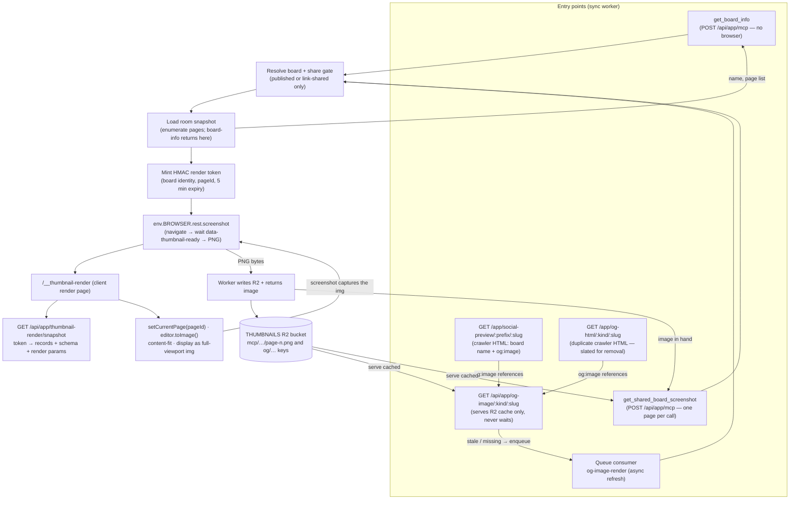

# Browser Run thumbnails and MCP screenshots

Issues:

- <https://github.com/tldraw/tldraw/issues/9502>
- <https://github.com/tldraw/tldraw/issues/9497>

tldraw.com can capture PNG thumbnails of public boards by taking a Cloudflare Browser Rendering `/screenshot` of a tldraw-owned render page, called straight through the `BROWSER` binding's `.rest` Quick Actions accessor — no `@cloudflare/puppeteer` and no API token. There are two consumers, both served by the sync worker:

- an MCP server at `POST /api/app/mcp` exposing two tools: `get_board_info` lists a board's pages (name, 0-based index, and whether each has content), and `get_shared_board_screenshot` returns a content-fit PNG of a single page. Each screenshot renders exactly one page, so an agent lists pages first and then requests the ones it wants; and
- a board OG image endpoint, `GET /api/app/og-image/:kind/:slug`, built for high-traffic paths (link unfurls, crawlers): it serves only from the R2 cache and delegates rendering to a queue consumer, so a request never waits on Browser Run.

Rendering runs through the Browser Rendering `/screenshot` Quick Action, invoked from the worker via the `BROWSER` binding's `.rest` accessor (`env.BROWSER.rest.screenshot`). Chrome runs in Cloudflare's Browser Rendering fleet, not in the worker isolate. The pipeline never hands the browser a user-provided URL: the worker resolves the board, verifies it is publicly viewable (a published board, or a file shared via link), mints a short-lived signed render job, and the screenshot only ever targets the internal render page with that token. The MCP surface exposes page metadata (names, counts) and page screenshots only: no document structure, shape listing, arbitrary selectors, arbitrary URLs, or access to files that are not publicly shared.

## Architecture

1. A client calls `get_shared_board_screenshot` with a board id — the `:slug` of a published board (`https://www.tldraw.com/p/:slug`) or of an anonymously-shared file (`https://www.tldraw.com/f/:slug`) — a 0-based `page` ordinal (default 0), and an optional theme (default light). It usually calls `get_board_info` first to discover the board's pages.
2. The sync worker resolves the id as a shared file first and as a published-board slug second, so callers never need to know which kind of board they hold. Shared files resolve the id directly as the `file.id` (`getSharedFileInfo`) and must pass the same anonymous-view gate the live file room enforces: the file exists, is not deleted, and is `shared` via link (`isFileAnonymouslyViewable`). `sharedLinkType` (`view` vs `edit`) is irrelevant to viewing; test-slug files are refused because they require admin auth the anonymous tool never has. Published boards resolve through the `file` row (`getPublishedFileInfo`) and must be published. Unknown, unpublished, or private boards fail without spending any Browser Rendering capacity.
3. The worker builds a per-page R2 cache key from board identity, a content version, the fixed 1200x630 output size, theme, and the page ordinal (`mcp/{kind}/{slug}/{version}/1200x630/{theme}/page-{n}.png`), with the page name in object metadata. The version is the file's `lastPublished` for published boards and the persisted room snapshot's R2 etag for shared files, so republishing or editing rotates every page's key. A cache hit in the `THUMBNAILS` bucket returns immediately — without even loading the board snapshot, since the ordinal alone keys the object and the page name rides in its metadata.
4. On a miss, the worker loads the board's room snapshot to resolve the ordinal to a real page (its `TLPageId` and name) and to validate the range, then mints an HMAC-signed render token (`renderTokens.ts`) carrying the board identity, that `pageId`, and render parameters with a 5 minute expiry.
5. The worker calls the Browser Rendering `/screenshot` Quick Action through `env.BROWSER.rest.screenshot`, targeting `{MCP_SCREENSHOT_RENDER_ORIGIN}/__thumbnail-render?token=...`. The render page (`apps/dotcom/client/src/pages/thumbnail-render.tsx`) exchanges the token for snapshot data at `GET /api/app/thumbnail-render/snapshot`, which verifies the signature and expiry before returning records, schema, and render params. Published boards read a frozen R2 snapshot; shared files read the live persisted room snapshot from R2 (`env.ROOMS`) and re-check the share gate here, not just when the token was minted, so a board un-shared during the token's 5 minute window stops resolving. The page selects the requested `pageId`, content-fits it with margins once fonts and image assets have settled, exports it with `editor.toImage`, and then displays that PNG as a full-viewport `` and sets `data-thumbnail-ready` — so the screenshot captures the exact export rather than the live editor canvas. An export failure sets `data-thumbnail-error` and never sets the ready selector, so the screenshot times out and surfaces as a render failure.
6. The screenshot response body is the PNG bytes. The worker writes them to the page's cache key in R2 (for future hits) and returns two MCP content items: a text item with the page name, followed by the image.

### OG images (queue-backed async rendering)

`GET /api/app/og-image/:kind/:slug` (`:kind` is `p` for published boards or `f` for shared files) serves a 1200x630 light-theme, content-fit PNG for use in `og:image` tags; `GET /api/app/og-html/:kind/:slug` serves crawler metadata pointing at it. The request path never invokes Browser Run:

1. The board is resolved through the same gates as the MCP tool. Private, deleted, unpublished, or unknown boards redirect (302) to the default tldraw OG image.
2. If the cached image in R2 matches the board's current content version - or is younger than one hour, which caps one board's Browser Run spend at roughly one render per hour no matter how often it changes or is crawled - it is served as a hit with `max-age=3600`.
3. Otherwise the worker enqueues an `og-image-render` job on the existing sync-worker queue (guarded by a per-board rate limit and a two-minute pending marker in R2 that dedupes concurrent enqueues) and serves the previous image marked stale with `max-age=300`, or the default-image redirect with `max-age=60` if the board has never been rendered. Scrapers pick up the fresh render on their next visit.
4. The queue consumer (`ogImageQueue.ts`, dispatched from the worker's `queue()` handler) re-resolves the board at render time: a board un-shared while queued is dropped and its cached OG image deleted, and the version is re-read so bursts of enqueues coalesce into one capture of the newest content. It checks the shared global Browser Rendering rate limit (requeueing when capacity is busy), mints a render token with `camera: 'content'` and no `pageId` (so the render page uses whichever page the snapshot opens to), screenshots it through the same `env.BROWSER.rest.screenshot` path as the MCP tool, and writes the PNG to the cache key the route reads. Transient failures retry up to three times with backoff, then drop.

### Request limits

- Per IP: ~20 tool calls per minute (`MCP_SCREENSHOT_RATE_LIMITER`).
- Per board: ~20 Browser Run captures per minute, applied only on cache misses.
- Global: ~60 Browser Run captures per minute across all callers (`MCP_SCREENSHOT_BROWSER_RATE_LIMITER`).

The Cloudflare rate limit bindings are declared in `wrangler.toml` for every environment. When a binding is absent (local dev, tests) the route falls back to an isolate-local guard with the same limits.

### Telemetry and monitoring

All three surfaces write `mcp_shared_board_screenshot` events with the same blob layout, so one dashboard covers everything; the source blob distinguishes `mcp` (the tool), `og` (the OG image route), and `queue` (the async consumer). Events record hashed IP, hashed board slug, cache hit/stale/miss, render duration (wall-clock around the browser session), output dimensions, failure reason (including which rate limit blocked a request), and rate-limit decisions. Column layout in the Analytics Engine dataset (`MEASURE`): `blob1` event name, `blob2` worker name, `blob3` source, `blob4` cache status, `blob5` failure reason, `blob6` rate-limit decision, `blob7` hashed IP, `double3` render duration ms, `double4` browser ms used, `index1` hashed board slug. (The `BROWSER` binding does not surface a per-render billed-ms figure the way the old REST `X-Browser-Ms-Used` header did, so `double4` is now always -1.)

`internal/scripts/fetch-screenshot-metrics.ts` queries the Analytics Engine SQL API and reports request volume, failure rate, timeout rate, cache hit rate, rate-limit blocks, and Browser Run spend per source:

```bash
CLOUDFLARE_ACCOUNT_ID=... CLOUDFLARE_ANALYTICS_API_TOKEN=... \
npx tsx internal/scripts/fetch-screenshot-metrics.ts --last 24h --worker main-tldraw-multiplayer
```

For alerting, run it with `--check` on a schedule (cron CI job or any monitor that can run a command); it exits non-zero when a threshold is breached:

```bash
npx tsx internal/scripts/fetch-screenshot-metrics.ts --last 1h --check \
  --max-failure-rate 0.2 --max-timeout-rate 0.1 --max-browser-minutes 60
```

The API token only needs the "Account Analytics: Read" permission. Ad-hoc dashboard queries can use the same SQL API, e.g. failure breakdown over the last day:

```sql
SELECT blob3 AS source, blob5 AS failure, SUM(_sample_interval) AS requests
FROM MEASURE
WHERE blob1 = 'mcp_shared_board_screenshot' AND timestamp > NOW() - INTERVAL '24' HOUR
GROUP BY source, failure
ORDER BY requests DESC
```

## Configuration

The sync worker needs:

- `BROWSER` binding - the Cloudflare Browser Rendering binding, declared per environment in `wrangler.toml` (`[env.<env>.browser]`). The worker calls its `.rest` Quick Actions (`env.BROWSER.rest.screenshot`) directly — no `@cloudflare/puppeteer`, no API token. The dev binding is marked `remote = true`, so `wrangler dev` runs the worker locally while `BROWSER` proxies to the real remote service; it needs Cloudflare credentials in the local environment, and is left undefined (render path fails closed with a config error) without them.
- `MCP_SCREENSHOT_TOKEN_SECRET` (deploy var, GitHub secret) - HMAC secret for render tokens. Local dev uses the placeholder in `[env.dev.vars]`.
- `MCP_SCREENSHOT_RENDER_ORIGIN` - set in `wrangler.toml` for dev (`http://localhost:3000`), staging, and production. Preview deploys have no `wrangler.toml` entry, so `deploy-dotcom.ts` injects the preview's own client origin (`https://${previewId}-preview-deploy.tldraw.com`) as a deploy var.
- `THUMBNAILS` R2 bucket binding - `thumbnails-preview` in dev/preview/staging and `thumbnails` in production.

One-time ops setup before the first deploy of this feature:

1. Create the R2 buckets: `wrangler r2 bucket create thumbnails-preview` and `wrangler r2 bucket create thumbnails`.
2. Enable Browser Rendering on the Cloudflare account (the `BROWSER` binding needs it) and add the `MCP_SCREENSHOT_TOKEN_SECRET` GitHub secret. Until the secret exists the deploy passes an empty string and the MCP tool returns a configuration error instead of failing the deploy.

## Local development

Start the dotcom app from the repo root:

```bash
yarn dev-app
```

The dev-only fixture page renders allowlisted example snapshots without a worker, published file, or token:

```
/dev/browser-run-thumbnail?fixture=layer-panel&x=340&y=120&z=0.82&width=1200&height=630&theme=dark
```

Capture it locally without Cloudflare credentials:

```bash
yarn workspace dotcom browser-run-thumbnail \
  --mode local \
  --base-url http://127.0.0.1:3000 \
  --fixture snapshot-example \
  --output tmp/browser-run-thumbnail/local-thumbnail.png
```

To capture through real Browser Run, use a preview/dev deployment or a tunnel (Browser Run cannot reach `127.0.0.1`):

```bash
CLOUDFLARE_ACCOUNT_ID=... \
CLOUDFLARE_API_TOKEN=... \
yarn workspace dotcom browser-run-thumbnail \
  --mode browser-run \
  --base-url https://your-dev-or-preview-origin.example \
  --fixture layer-panel \
  --output tmp/browser-run-thumbnail/browser-run-thumbnail.png
```

When tunnelling with Vite's host checks, start the client with:

```bash
VITE_ALLOWED_HOSTS=your-tunnel-host.example yarn workspace dotcom exec vite dev --host 127.0.0.1 --port 3000 --strictPort
```

The production path (`/__thumbnail-render` plus `/api/app/thumbnail-render/snapshot`) can be exercised locally against a locally published file: call `POST /app/mcp` on the local sync worker with `tools/call`; the returned render URL can be opened directly in a browser while the token is valid.

To drive the full worker render path locally — the MCP tool or OG queue actually taking a screenshot — the `BROWSER` binding is marked `remote = true` in `[env.dev.browser]`. `wrangler dev` keeps the whole worker and every other binding local, while `BROWSER` proxies to the real remote Browser Rendering service, so no `--remote` and no separate render sidecar are needed. It does require Cloudflare credentials (`CLOUDFLARE_ACCOUNT_ID` and an API token with `Browser Rendering` access) in the local environment; without them the binding is undefined and the render path returns a configuration error rather than rendering. Credentials being needed for real captures is the same requirement the previous REST-based path had — the binding just moves it behind `wrangler dev` instead of a tunnel.

## MCP tools

```ts
get_board_info({
 boardId: string,
})
// → { name: string | null, pageCount: number, pages: { index: number, name: string, hasContent: boolean }[] }

get_shared_board_screenshot({
 boardId: string,
 page?: number, // 0-based page index (see get_board_info). default 0
 theme?: 'light' | 'dark', // default 'light'
})
// → text (page name) + a 1200x630 content-fit PNG of that one page
```

Both tools accept the id of a public tldraw.com board: the `:slug` of a published board URL (`https://www.tldraw.com/p/:slug`) or of an anonymously-shared file URL (`https://www.tldraw.com/f/:slug`). The id is resolved as a shared file first and a published slug second. A shared file is only served when it is currently shared via link; private (unshared) files, deleted files, and test files are refused.

`get_shared_board_screenshot` renders exactly one page per call, so an agent typically calls `get_board_info` once to enumerate pages (using `hasContent` to skip blank ones), then requests screenshots for the pages it wants — each cached independently. This keeps every screenshot to a single Browser Rendering `/screenshot` call regardless of how many pages a board has.

The screenshot layer lives in the dotcom sync worker rather than the interactive `apps/mcp-app` canvas worker because it needs real tldraw.com published-file resolution and storage, not a live editor bridge.

## Remaining follow-up work

- Schedule `fetch-screenshot-metrics.ts --check` somewhere (cron CI job or an external monitor) and point a dashboard at the SQL queries above; the script and queries exist, the scheduling is an ops decision.
- Shared files render the last persisted room snapshot from R2, which can lag in-memory edits by the persist debounce. If near-real-time accuracy is ever required, add a `getCurrentSnapshot` RPC on `TLFileDurableObject` (modeled on `onDownloadTldr`) instead of reading R2.
- Keep private (unshared) files, board metadata, document structure, current-viewport screenshots, and selected-shape screenshots out of the MCP scope.

## System map

The pixels come from `editor.toImage` on the render page. The worker calls the Browser Rendering `/screenshot` Quick Action through `env.BROWSER.rest.screenshot`, which navigates the render page and captures it once `data-thumbnail-ready` appears (or times out on `data-thumbnail-error`). The render page renders one page, exports it with `editor.toImage`, and displays that PNG as a full-viewport `` — so the screenshot is the exact export. The screenshot response body is the PNG, which the worker writes to R2 and returns. No puppeteer, no API token, no page-side upload endpoint.



### Follow-up work

The MCP/OG rework and the Browser Rendering binding migration described above are implemented. Still outstanding:

- Rename `GET /app/og-image/:kind/:slug` to `GET /app/social-preview/:prefix/:slug/image`, so the crawler HTML and its image live under one route family.
- Delete `GET /app/og-html/:kind/:slug` and its Vercel route: `getSocialPreview` supersedes it (board name in the title, human bounce-back). Removing the Vercel route also fixes a live bug — crawler-UA in-app browsers (WhatsApp, Pinterest) bounced back with the bypass param currently fall through to the og-html stub, which has no redirect, so real users never reach the board. It also makes `SOCIAL_PREVIEW_DISABLED` a complete kill switch; today it only disables the social-preview route while og-html keeps serving crawlers.
- Move `useThumbnailPageSize` from `thumbnail-render.tsx` to the dev fixture page — only the dev capture script's local Playwright mode still screenshots a viewport.
- Consider moving the shared thumbnail dimension constants (default 1200x630, clamp 200-1600) into `@tldraw/dotcom-shared`; they are currently duplicated between `sharedBoardScreenshotMcp.ts` and `thumbnail-render.tsx`.
