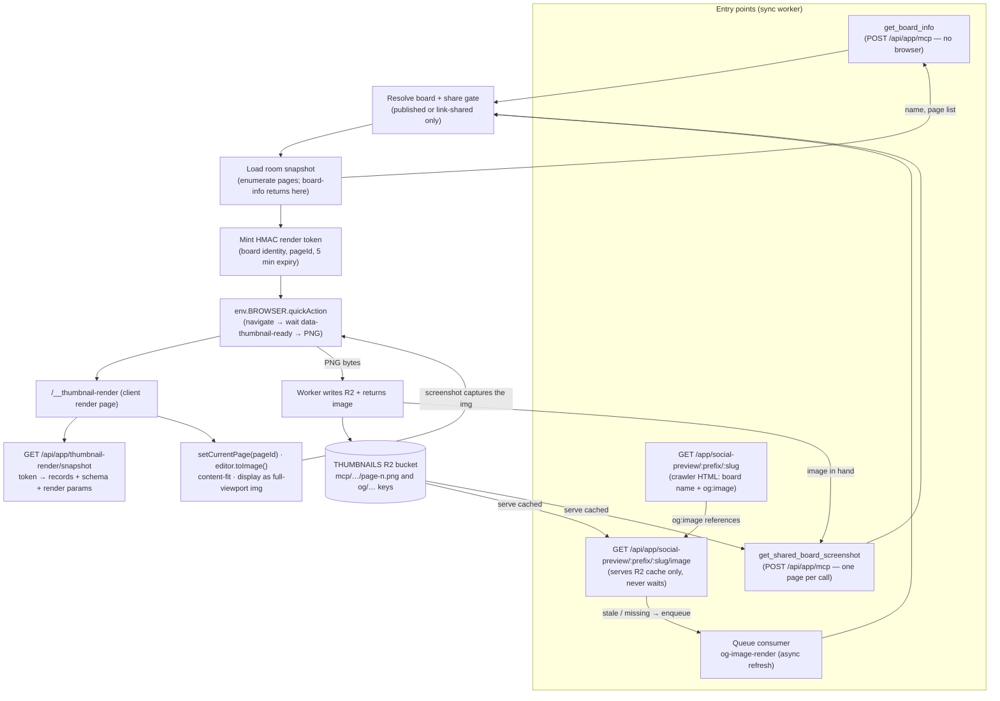
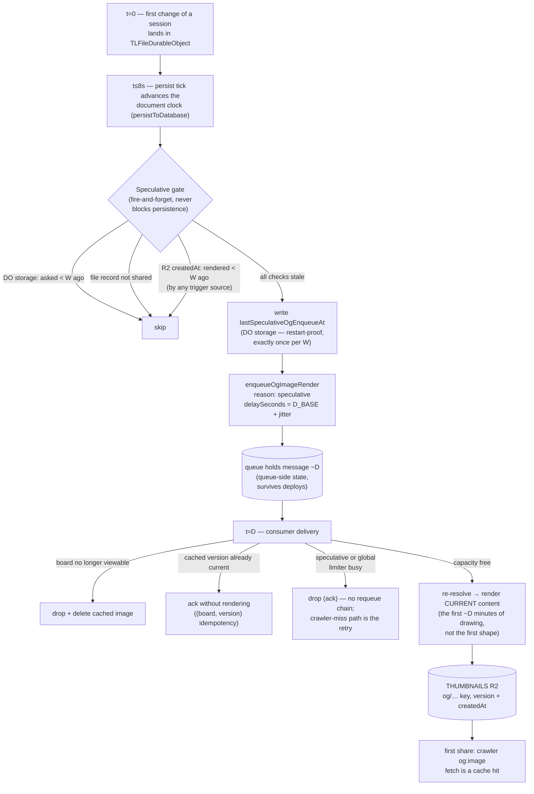

# Browser Run thumbnails and MCP screenshots

Issues:

- <https://github.com/tldraw/tldraw/issues/9502>
- <https://github.com/tldraw/tldraw/issues/9497>

tldraw.com can capture PNG thumbnails of public boards by taking a Cloudflare Browser Rendering `/screenshot` of a tldraw-owned render page, called straight through the `BROWSER` binding's `quickAction` Quick Actions method — no `@cloudflare/puppeteer` and no API token (requires `compatibility_date >= 2026-03-24`). There are two consumers, both served by the sync worker:

- an MCP server at `POST /api/app/mcp` exposing two tools: `get_board_info` lists a board's pages (name, 0-based index, and whether each has content), and `get_shared_board_screenshot` returns a content-fit PNG of a single page. Each screenshot renders exactly one page, so an agent lists pages first and then requests the ones it wants; and
- a board OG image endpoint, `GET /api/app/social-preview/:prefix/:slug/image`, built for high-traffic paths (link unfurls, crawlers): it serves only from the R2 cache and delegates rendering to a queue consumer, so a request never waits on Browser Run. It lives under the `social-preview` route family alongside the crawler HTML that references it.

Rendering runs through the Browser Rendering `/screenshot` Quick Action, invoked from the worker via the `BROWSER` binding's `quickAction` method (`env.BROWSER.quickAction('screenshot', …)`). Chrome runs in Cloudflare's Browser Rendering fleet, not in the worker isolate. The pipeline never hands the browser a user-provided URL: the worker resolves the board, verifies it is publicly viewable (a published board, or a file shared via link), mints a short-lived signed render job, and the screenshot only ever targets the internal render page with that token. The MCP surface exposes page metadata (names, counts) and page screenshots only: no document structure, shape listing, arbitrary selectors, arbitrary URLs, or access to files that are not publicly shared.

## Architecture

1. A client calls `get_shared_board_screenshot` with a board id — the `:slug` of a published board (`https://www.tldraw.com/p/:slug`) or of an anonymously-shared file (`https://www.tldraw.com/f/:slug`) — a 0-based `page` ordinal (default 0), and an optional theme (default light). It usually calls `get_board_info` first to discover the board's pages.
2. The sync worker resolves the id as a shared file first and as a published-board slug second, so callers never need to know which kind of board they hold. Shared files resolve the id directly as the `file.id` (`getSharedFileInfo`) and must pass the same anonymous-view gate the live file room enforces: the file exists, is not deleted, and is `shared` via link (`isFileAnonymouslyViewable`). `sharedLinkType` (`view` vs `edit`) is irrelevant to viewing; test-slug files are refused because they require admin auth the anonymous tool never has. Published boards resolve through the `file` row (`getPublishedFileInfo`) and must be published. Unknown, unpublished, or private boards fail without spending any Browser Rendering capacity.
3. The worker builds a per-page R2 cache key from board identity, a content version, the fixed 1200x630 output size, theme, and the page ordinal (`mcp/{kind}/{slug}/{version}/1200x630/{theme}/page-{n}.png`), with the page name in object metadata. The version is the file's `lastPublished` for published boards and the persisted room snapshot's R2 etag for shared files, so republishing or editing rotates every page's key. A cache hit in the `THUMBNAILS` bucket returns immediately — without even loading the board snapshot, since the ordinal alone keys the object and the page name rides in its metadata.
4. On a miss, the worker loads the board's room snapshot to resolve the ordinal to a real page (its `TLPageId` and name) and to validate the range, then mints an HMAC-signed render token (`renderTokens.ts`) carrying the board identity, that `pageId`, and render parameters with a 5 minute expiry. Page enumeration is capped at `MAX_THUMBNAIL_PAGES` (40), so `pageCount` and the addressable ordinals stop there on very large boards. The snapshot route re-checks that `pageId` still exists at render time: a page deleted inside the token's window fails the render rather than returning a different page's image under the original page's name.
5. The worker calls the Browser Rendering `/screenshot` Quick Action through `env.BROWSER.quickAction`, targeting `{MCP_SCREENSHOT_RENDER_ORIGIN}/__thumbnail-render?token=...`. The render page (`apps/dotcom/client/src/pages/thumbnail-render.tsx`) exchanges the token for snapshot data at `GET /api/app/thumbnail-render/snapshot`, which verifies the signature and expiry before returning records, schema, and render params. Published boards read a frozen R2 snapshot; shared files read the live persisted room snapshot from R2 (`env.ROOMS`) and re-check the share gate here, not just when the token was minted, so a board un-shared during the token's 5 minute window stops resolving. The page selects the requested `pageId`, content-fits it with margins once fonts and image assets have settled, exports it with `editor.toImage`, and then displays that PNG as a full-viewport `` and sets `data-thumbnail-ready` — so the screenshot captures the exact export rather than the live editor canvas. Any failure (bad token, snapshot load, export, image decode) sets `data-thumbnail-error` instead. The Quick Action waits for _either_ terminal marker and captures `body[data-thumbnail-ready="true"]`, which only exists on the success path — so a failed render returns as soon as it errors rather than holding Browser Run capacity for the whole timeout. The render and settle budgets (`THUMBNAIL_RENDER_TIMEOUT_MS` 45s, `THUMBNAIL_SETTLE_TIMEOUT_MS` 10s) live in `@tldraw/dotcom-shared` so the worker's deadline and the page's can't drift.
6. The screenshot response body is the PNG bytes. The worker writes them to the page's cache key in R2 (for future hits) and returns two MCP content items: a text item with the page name, followed by the image.

### OG images (queue-backed async rendering)

`GET /api/app/social-preview/:prefix/:slug/image` (`:prefix` is `p` for published boards or `f` for shared files) serves a 1200x630 light-theme, content-fit PNG for use in `og:image` tags. The crawler HTML that references it is the existing worker route `/app/social-preview/:prefix/:slug` (`getSocialPreview`, which Vercel routes crawler user-agents to), which puts the board name in the title and bounces human visitors back to the board. It only emits the board `og:image` (and `summary_large_image`) when the board resolves through the same gate the image route applies; for private, deleted, or unpublished boards it keeps the static site-wide preview image, because crawlers that don't follow `og:image` redirects (notably X) would otherwise render a broken card. The request path never invokes Browser Run:

1. The board is resolved through the same gates as the MCP tool. Private, deleted, unpublished, or unknown boards redirect (302) to the default tldraw OG image.
2. If the cached image in R2 matches the board's current content version - or is younger than one hour, which caps one board's Browser Run spend at roughly one render per hour no matter how often it changes or is crawled - it is served as a hit with `max-age=3600`.
3. Otherwise the worker enqueues an `og-image-render` job on the existing sync-worker queue (guarded by a per-board rate limit and a two-minute pending marker in R2 that dedupes concurrent enqueues) and serves the previous image marked stale with `max-age=300`, or the default-image redirect with `max-age=60` if the board has never been rendered. Scrapers pick up the fresh render on their next visit. The route is registered with `.all`, because crawlers probe with HEAD before (or instead of) GET: a HEAD gets the same cache/redirect headers from an R2 `head`, but never reads the body and never enqueues, so a probe can't spend Browser Run.
4. The queue consumer (`ogImageQueue.ts`, dispatched from the worker's `queue()` handler) re-resolves the board at render time: a board un-shared while queued is dropped and its cached OG image deleted, and the version is re-read so bursts of enqueues coalesce into one capture of the newest content. It checks the shared global Browser Rendering rate limit (the same `global` limiter key the MCP tool uses, so both surfaces draw from one cap), loads the snapshot to pick the first page that _has content_ (so a board with an empty first page still unfurls with a meaningful image), mints a render token with `camera: 'content'` and that `pageId`, screenshots it through the same `env.BROWSER.quickAction` path as the MCP tool, and writes the PNG to the cache key the route reads. If the snapshot can't be read it fails there and then rather than paying for a capture that would fail on the render page for the same reason. Genuine transient failures retry up to three times with backoff, then drop. When global capacity is busy the job is instead re-enqueued as a fresh message on its own budget (so backpressure never consumes the failure-retry budget), with exponential backoff capped at two minutes and a maximum of 12 requeues — after that the chain gives up so its own capacity checks stop crowding the shared limiter, and the next crawler hit re-enqueues once capacity recovers.

### Request limits

- Per IP: ~2 calls per minute each for `get_board_info` (`ip-info:`) and `get_shared_board_screenshot` (`ip-shot:`), on separate keys of `MCP_SCREENSHOT_RATE_LIMITER`. They are separate because `get_board_info` spends no Browser Run, and sharing one budget would let the usual "list once, then screenshot pages" flow burn its allowance on the free call.
- Per board: ~2 Browser Run captures per minute, applied only on cache misses. The OG route applies the same limit to its own key (`og-board:`) to bound queue enqueues per board.
- Global: ~6 Browser Run captures per minute across all callers (`MCP_SCREENSHOT_BROWSER_RATE_LIMITER`), shared by the MCP tool and the OG queue consumer via the single `global` key.

The Cloudflare rate limit bindings are declared in `wrangler.toml` for every environment. When a binding is absent (local dev, tests) the route falls back to an isolate-local guard with the same limits.

### Telemetry and monitoring

All three surfaces write `mcp_shared_board_screenshot` events with the same blob layout, so one dashboard covers everything; the source blob distinguishes `mcp` (the tool), `og` (the OG image route), and `queue` (the async consumer). Events record hashed board slug, cache hit/stale/miss, render duration (wall-clock around the browser session), output dimensions, failure reason, rate-limit decisions, and a hashed IP. Two dimensions are deliberately kept low-cardinality: the failure reason is always a bounded reason code (`invalid_input`, `not_found`, `board_empty`, `no_pages`, `page_out_of_range`, `rate_limited_ip`/`board`/`global`, `rate_limited_global_exhausted`, `board_not_viewable`, `not_rendered_yet`, `browser_failed`, `browser_timeout`, `empty_render`, `not_configured`, `render_error`), never raw `error.message` text; and the hashed IP is written only on failed or rate-limited events (where it's useful for abuse analysis) — successful events carry `ip:none`, so the per-client IP dimension never lands on the common success path. Column layout in the Analytics Engine dataset (`MEASURE`): `blob1` event name, `blob2` worker name, `blob3` source, `blob4` cache status, `blob5` failure reason, `blob6` rate-limit decision, `blob7` hashed IP (or `none`), `double1`/`double2` output width/height, `double3` render duration ms, `double4` browser ms used, `double5` rate-limit allowed (1/0), `index1` hashed board slug. (The `quickAction` screenshot response includes an `X-Browser-Ms-Used` header, but the worker does not currently read it — telemetry uses wall-clock render duration in `double3` as the spend proxy and writes `double4` as -1. Wiring the header into `double4` is a possible follow-up.)

Bounded reason codes say _that_ a board stopped rendering, never _why_, and every one of these surfaces deliberately swallows its own errors (the OG route falls back to the default image, the snapshot route 404s, the MCP tools return a tool error, the queue retries or drops). So each swallow point also reports the underlying error to Sentry through `reportThumbnailError` (`thumbnailShared.ts`), tagged `thumbnail_surface` with a closed set of values: `og_route`, `og_queue`, `thumbnail_snapshot`, `mcp_board_info`, `mcp_screenshot`. Reporting rides on the handler's `waitUntil` and is itself failure-proof — a missing Sentry env var must never turn a degraded-but-fine response into a 500.

`internal/scripts/fetch-screenshot-metrics.ts` queries the Analytics Engine SQL API and reports request volume, failure rate, timeout rate, cache hit rate, rate-limit blocks, and Browser Run render time per source (wall-clock `double3`, summed over rows that actually rendered — `double4` billed ms is not currently recorded, always -1):

```bash
CLOUDFLARE_ACCOUNT_ID=... CLOUDFLARE_ANALYTICS_API_TOKEN=... \
npx tsx internal/scripts/fetch-screenshot-metrics.ts --last 24h --worker main-tldraw-multiplayer
```

For alerting, run it with `--check` on a schedule (cron CI job or any monitor that can run a command); it exits non-zero when a threshold is breached:

```bash
npx tsx internal/scripts/fetch-screenshot-metrics.ts --last 1h --check \
  --max-failure-rate 0.2 --max-timeout-rate 0.1 --max-render-minutes 60
```

The API token only needs the "Account Analytics: Read" permission. Ad-hoc dashboard queries can use the same SQL API, e.g. failure breakdown over the last day:

```sql
SELECT blob3 AS source, blob5 AS failure, SUM(_sample_interval) AS requests
FROM MEASURE
WHERE blob1 = 'mcp_shared_board_screenshot' AND timestamp > NOW() - INTERVAL '24' HOUR
GROUP BY source, failure
ORDER BY requests DESC
```

## Configuration

The sync worker needs:

- `BROWSER` binding - the Cloudflare Browser Rendering binding, declared per environment in `wrangler.toml` (`[env.<env>.browser]`). The worker calls its `quickAction` Quick Actions method (`env.BROWSER.quickAction('screenshot', …)`) directly — no `@cloudflare/puppeteer`, no API token. This requires `compatibility_date` `2026-03-24` or later, which the deployed envs use; `[env.dev]` pins an older date the local workerd supports (see Local development). The dev binding is deliberately not `remote`, so plain `wrangler dev` (and the credential-free e2e stack) boots without a `CLOUDFLARE_API_TOKEN`; the binding is then a non-functional local one and the render path fails closed. Real local captures need `wrangler dev --remote` with credentials, or a preview deploy.
- `MCP_SCREENSHOT_ENABLED` - kill switch for the MCP server (`POST /app/mcp`), set to `"true"` in `wrangler.toml` for dev, staging, and production. The worker reads it per request, so setting it to anything else takes the endpoint down (it 404s, including the `initialize` handshake) without a rebuild or a code deploy — flip it in the Cloudflare dashboard under the worker's variables, and it applies to the next request. The next deploy overwrites the dashboard value from `wrangler.toml`, so follow an emergency flip with a config change. An unset var counts as enabled, so preview deploys (which don't set it) behave as they always have. Only the MCP server is gated: OG image rendering has its own path and keeps running.
- `MCP_SCREENSHOT_TOKEN_SECRET` (deploy var, GitHub secret) - HMAC secret for render tokens. Local dev uses the placeholder in `[env.dev.vars]`.
- `MCP_SCREENSHOT_RENDER_ORIGIN` - set in `wrangler.toml` for dev (`http://localhost:3000`), staging, and production. Preview deploys have no `wrangler.toml` entry, so `deploy-dotcom.ts` injects the preview's own client origin (`https://${previewId}-preview-deploy.tldraw.com`) as a deploy var.
- `THUMBNAILS` R2 bucket binding - `thumbnails-preview` in dev/preview/staging and `thumbnails` in production.

One-time ops setup before the first deploy of this feature:

1. Create the R2 buckets: `wrangler r2 bucket create thumbnails-preview` and `wrangler r2 bucket create thumbnails`.
2. Enable Browser Rendering on the Cloudflare account (the `BROWSER` binding needs it) and add the `MCP_SCREENSHOT_TOKEN_SECRET` GitHub secret. Until the secret exists the deploy passes an empty string and the MCP tool returns a configuration error instead of failing the deploy.

## Local development

Start the dotcom app from the repo root:

```bash
yarn dev-app
```

The dev-only fixture page renders allowlisted example snapshots without a worker, published file, or token:

```
/dev/browser-run-thumbnail?fixture=layer-panel&x=340&y=120&z=0.82&width=1200&height=630&theme=dark
```

Capture it locally without Cloudflare credentials:

```bash
yarn workspace dotcom browser-run-thumbnail \
  --mode local \
  --base-url http://127.0.0.1:3000 \
  --fixture snapshot-example \
  --output tmp/browser-run-thumbnail/local-thumbnail.png
```

To capture through real Browser Run, use a preview/dev deployment or a tunnel (Browser Run cannot reach `127.0.0.1`):

```bash
CLOUDFLARE_ACCOUNT_ID=... \
CLOUDFLARE_API_TOKEN=... \
yarn workspace dotcom browser-run-thumbnail \
  --mode browser-run \
  --base-url https://your-dev-or-preview-origin.example \
  --fixture layer-panel \
  --output tmp/browser-run-thumbnail/browser-run-thumbnail.png
```

When tunnelling with Vite's host checks, start the client with:

```bash
VITE_ALLOWED_HOSTS=your-tunnel-host.example yarn workspace dotcom exec vite dev --host 127.0.0.1 --port 3000 --strictPort
```

The production path (`/__thumbnail-render` plus `/api/app/thumbnail-render/snapshot`) can be exercised locally against a locally published file by calling `POST /app/mcp` on the local sync worker with `tools/call`. The tool returns the page name and the PNG itself, not the render URL — the URL is internal to the worker, so to open the render page in a browser you have to mint a token yourself (`mintThumbnailRenderToken`, using the `MCP_SCREENSHOT_TOKEN_SECRET` from `[env.dev.vars]`) and build `/__thumbnail-render?token=…` by hand.

To drive the full worker render path locally — the MCP tool or OG queue actually taking a screenshot — run `wrangler dev --remote` with Cloudflare credentials (`CLOUDFLARE_ACCOUNT_ID` and an API token with `Browser Rendering` access) so the `BROWSER` binding reaches the real remote Browser Rendering service. The dev binding is deliberately NOT marked `remote = true` in `[env.dev.browser]`: a remote binding makes plain `wrangler dev` require a `CLOUDFLARE_API_TOKEN`, which the credential-free process-compose e2e stack does not have, so it would fail to boot. Under plain `wrangler dev` the `BROWSER` binding is a non-functional local binding and the render path fails closed with a config error — fine for everything except real captures, which need `--remote` or a preview deploy. Note also that `[env.dev]` pins `compatibility_date` to `2025-06-05` (the deployed envs use `2026-03-24`, required for `quickAction`, but that is newer than the workerd bundled with our pinned wrangler, so local `wrangler dev` can't use it — real local captures therefore need a preview deploy until the toolchain catches up).

## MCP tools

```ts
get_board_info({
 boardId: string,
})
// → { name: string | null, pageCount: number, pages: { index: number, name: string, hasContent: boolean }[] }

get_shared_board_screenshot({
 boardId: string,
 page?: number, // 0-based page index (see get_board_info). default 0
 theme?: 'light' | 'dark', // default 'light'
})
// → text (page name) + a 1200x630 content-fit PNG of that one page
```

Both tools accept the id of a public tldraw.com board: the `:slug` of a published board URL (`https://www.tldraw.com/p/:slug`) or of an anonymously-shared file URL (`https://www.tldraw.com/f/:slug`). The id is resolved as a shared file first and a published slug second. A shared file is only served when it is currently shared via link; private (unshared) files, deleted files, and test files are refused.

`get_shared_board_screenshot` renders exactly one page per call, so an agent typically calls `get_board_info` once to enumerate pages (using `hasContent` to skip blank ones), then requests screenshots for the pages it wants — each cached independently. This keeps every screenshot to a single Browser Rendering `/screenshot` call regardless of how many pages a board has.

The screenshot layer lives in the dotcom sync worker rather than the interactive `apps/mcp-app` canvas worker because it needs real tldraw.com published-file resolution and storage, not a live editor bridge.

## Remaining follow-up work

- Schedule `fetch-screenshot-metrics.ts --check` somewhere (cron CI job or an external monitor) and point a dashboard at the SQL queries above; the script and queries exist, the scheduling is an ops decision.
- Shared files render the last persisted room snapshot from R2, which can lag in-memory edits by the persist debounce. If near-real-time accuracy is ever required, add a `getCurrentSnapshot` RPC on `TLFileDurableObject` (modeled on `onDownloadTldr`) instead of reading R2.
- Keep private (unshared) files, board metadata, document structure, current-viewport screenshots, and selected-shape screenshots out of the MCP scope.

## System map

The pixels come from `editor.toImage` on the render page. The worker calls the Browser Rendering `/screenshot` Quick Action through `env.BROWSER.quickAction`, which navigates the render page, waits for either terminal marker, and captures the success-only `body[data-thumbnail-ready="true"]` element (so `data-thumbnail-error` returns a render failure immediately instead of waiting out the timeout). The render page renders one page, exports it with `editor.toImage`, and displays that PNG as a full-viewport `` — so the screenshot is the exact export. The screenshot response body is the PNG, which the worker writes to R2 and returns. No puppeteer, no API token, no page-side upload endpoint.



### Follow-up work

The MCP/OG rework and the Browser Rendering binding migration described above are implemented. Since then:

- Done: the board image endpoint is `GET /api/app/social-preview/:prefix/:slug/image` (worker route `/app/social-preview/:prefix/:slug/image`), so the crawler HTML and its image share one route family.
- Done: `GET /app/og-html/:kind/:slug` and its Vercel route are removed. `getSocialPreview` supersedes it (board name in the title, human bounce-back), which also fixed the live bug where crawler-UA in-app browsers (WhatsApp, Pinterest) bounced back with the bypass param fell through the og-html stub (no redirect) and never reached the board, and made `SOCIAL_PREVIEW_DISABLED` a complete kill switch.
- Done: the shared thumbnail dimension constants (default 1200x630, clamp 200-1600) live in `@tldraw/dotcom-shared`; the worker and the client render page both import them.

Not doing:

- `useThumbnailPageSize` stays in `thumbnail-render.tsx`. It is load-bearing for the production render page, not dev-only: the render page displays the export as a full-viewport `` and Browser Run takes a viewport screenshot of it, and the dotcom client has no global `body { margin: 0 }` reset (only `#root { width/height: 100% }` in `index.html`), so without the hook's `margin: 0` the browser's default 8px body margin would offset the image and the screenshot would show a white border and clip the bottom-right of every thumbnail.

## Plan: real thumbnails on first share

Status: planned, not started.

### Problem

The first crawler to unfurl a board hits a cold OG-image cache, gets the default image (a 302 to `/social-og.png`), and platforms cache that unfurl card on their side for days — so the first share is permanently wrong even though the queued render lands seconds later. X is the worst case: it does not follow the `og:image` 302 at all (the reason `getSocialPreview` currently withholds the per-board image URL for unrenderable boards), and it poison-caches whatever it sees first.

### Strategy

Make the thumbnail exist before the first crawler arrives, and make every residual miss degrade gracefully. No synchronous rendering on crawler paths; all existing herd protection (pending marker, per-board and global rate limiters, the queue) stays load-bearing.

| Layer                                                           | Covers                                                | Cost                                  |
| --------------------------------------------------------------- | ----------------------------------------------------- | ------------------------------------- |
| 1. Fallback-200 instead of 302                                  | every residual miss; fixes X broken cards             | ~zero                                 |
| 2. Publish hook                                                 | explicit publish/republish, always fresh              | negligible                            |
| 3. First-content-per-session trigger (delayed, staleness-gated) | the create → draw → share flow and revived old boards | ~1 render per edited board per window |
| 4. Hop-1 warming (optional)                                     | immediate shares, never-edited-again boards           | negligible                            |

The existing on-miss enqueue and stale-serve behavior in `getOgImage` remains the universal backstop, unchanged.

### Phase 0 — measure (no code)

Pull two numbers from existing telemetry (`mcp_shared_board_screenshot` dataset via `internal/scripts/fetch-screenshot-metrics.ts`; `room_empty`/persist log events):

- daily unique boards with contentful edit sessions
- daily unique boards receiving og-image fetches

This ratio sizes the staleness window `W`, the speculative budget cap, and the rollout sampling percentage. It also sizes the raised global Browser Run cap (see below — raising it is decided; the data picks the number).

### Phase 1 — fallback-200 and publish hook

Serve default bytes instead of redirecting (`getOgImage.ts`):

- Replace `redirectToDefaultOgImage` with a 200 `image/png` response serving the default image bytes; `cache-control: public, max-age=60`, no `s-maxage`, so neither the crawler nor any edge pins the fallback under the stable per-board URL once the real image lands.
- Bytes source: fetch `${publicOrigin}/social-og.png` once and memoize in isolate memory (no worker asset pipeline needed).
- Verify `social-og.png` is 1200x630 to match the `og:image:width`/`height` meta `getSocialPreview` emits; if not, add a correctly sized variant.
- No `getSocialPreview` change needed: the private-board gate stays (correct for never-renderable boards); public-but-cold boards already get the per-board URL and now receive a valid 200 instead of the 302 X chokes on.
- Telemetry: distinguish `served_fallback` from the old redirect so the self-heal rate is measurable per platform.

`delaySeconds` support in `enqueueOgImageRender` (`ogImageQueue.ts`):

- Add `opts?: { delaySeconds?: number, reason?: OgRenderReason }`; pass `delaySeconds` to `QUEUE.send`; size the pending marker as `expiresAt = now + delaySeconds * 1000 + PENDING_MARKER_TTL_MS`, mirroring `refreshOgImagePendingMarker`. This closes the gap where a marker with the fixed two-minute TTL would expire before a five-minute-delayed message delivers, letting a crawler miss enqueue a duplicate.
- `OgImageRenderQueueMessage` gains `reason: 'crawler' | 'publish' | 'speculative'` (default `'crawler'` for compatibility).

Publish → render; unpublish/unshare → cleanup (replicator):

- In the `publish` effect handler in `TLPostgresReplicator`, after `publishSnapshot` succeeds, call `enqueueOgImageRender(env, { kind: 'published', slug: file.publishedSlug }, { reason: 'publish' })`.
- `unpublish` effect: also delete the `og/published/...` cache key and pending marker.
- New `unshare` effect in `getEffects` (`ChangeCollator.ts`) on `shared` true → false: delete the `og/shared_file/...` cache key. Today an unshared board's image only gets deleted when a queue message happens to process for it; speculation renders many more boards, so lingering images need a real cleanup path.

### Raising the global Browser Run cap

Decided: the global ~6/min cap is too small for speculative rendering and will be raised; phase-0 data picks the value. 6/min is ~8.6k renders/day — almost certainly below the daily count of edited boards, so at the current cap speculation would spend its whole budget dropping.

Mechanics: the cap lives in two places that must move together — the `MCP_SCREENSHOT_BROWSER_RATE_LIMITER` bindings in `wrangler.toml` (`simple = { limit = 6, period = 60 }`, one binding per environment) and the isolate-local fallback constant `GLOBAL_BROWSER_RUN_RATE_LIMIT` in `sharedBoardScreenshotMcp.ts` (dev/tests only).

Sizing constraints on the new value:

- Phase-0 demand: edited boards/day (speculative) plus crawler-miss and publish traffic, with headroom.
- Cloudflare account-level Browser Rendering limits: concurrent browser sessions and new-sessions-per-minute must accommodate the cap. A render holds a session up to the 45s `THUMBNAIL_RENDER_TIMEOUT_MS` worst case, so a sustained N/min cap can demand up to ~0.75×N concurrent sessions when renders run long; check the account's limits (and request an increase if needed) before picking N.
- Spend: Browser Rendering bills by browser duration, so the cap is also the cost ceiling — worst case N/min × 45s.

The per-IP and per-board limits are unchanged: they guard abuse per client and per board, not total spend, and are already sized for that.

### Phase 2 — speculative first-content trigger

Trigger (`TLFileDurableObject` only; legacy rooms have no per-board OG images):

- In `persistToDatabase`'s success path, only on a persist that actually advanced the document clock (the `_lastPersistedClock` check), run the gate fire-and-forget — never blocking or failing persistence.
- The guard is `lastSpeculativeOgEnqueueAt` in DO storage, not an in-memory flag. The DO is the only possible speculative enqueuer for its board and is single-threaded with durable storage, so writing the timestamp before enqueueing gives exactly-once-per-window enqueue semantics that survive deploys, evictions, and crashes — a restart cannot cause duplicate speculative work. (Cloudflare Queues has no native idempotency keys; this is the application-level equivalent, and stronger than enqueue-time dedup on the queue could be, because the enqueuer itself is the per-board serialization point. The crawler path keeps its advisory R2 pending marker precisely because any isolate can serve a crawler — it has no equivalent authority.)
- The gate, with the decision logic extracted as a testable helper in `ogImageQueue.ts` (e.g. `maybeEnqueueSpeculativeOgRender`, taking the stored timestamp as input):
  1. Skip if `now - lastSpeculativeOgEnqueueAt < W` (read once per boot — the cheap, authoritative check).
  2. Skip unless the DO's cached file record says `shared` (if the record is not in hand, let the consumer's resolve drop the board instead).
  3. `THUMBNAILS.head` on the og cache key → if `createdAt` metadata is younger than `W`, skip. This second staleness check bounds renders across all trigger sources — a board a crawler-driven refresh just rendered doesn't get an immediate speculative re-render on its next edit. Gated behind the DO-storage check, it runs at most once per board per `W` rather than once per boot.
  4. Write `lastSpeculativeOgEnqueueAt`, then `enqueueOgImageRender(env, board, { delaySeconds: D_BASE + jitter, reason: 'speculative' })`.
- The guard is keyed on enqueue time, not render success — deliberately: a board whose speculative render fails or is dropped by the busy limiter does not retry until `W` elapses. The demand path (crawler miss) remains the retry mechanism with actual urgency behind it, and speculation stays strictly bounded. Anything that slips past every enqueue-time guard (at-least-once redelivery, marker races) is still absorbed at consume time by the version check — the system's real idempotency key is `(board, version)`, enforced where at-least-once delivery requires it.
- Initial constants, tuned by phase-0 data:
  - `W` (staleness window) = 12–24h — bounds spend at ≤1 speculative render per edited board per window. `W` is the cost dial: infinite `W` is a once-per-board-lifetime render; `W = 0` is once per session.
  - `D_BASE` = 180s, jitter +0–120s. The queue holds the message; the consumer's render-time re-resolve means the render captures the first minutes of drawing rather than the first shape. With the guard in DO storage, ordinary deploys no longer synchronize firings; the wave that remains is first rollout (and each sample-percentage increase), when every actively edited board has no stored timestamp yet and fires on its next persist — the jitter spreads exactly that.

Budget isolation (queue consumer):

- `reason: 'speculative'` messages check a new lower-cap limiter key (e.g. `global-speculative`, roughly half the global cap) before the shared global key, and on any busy signal drop (ack) — never entering the `requeueForRateLimit` chain. Speculation must never starve crawler-miss or publish renders. New rate limit binding per environment in `wrangler.toml`.
- Telemetry: a `reason` blob on queue datapoints.

Kill switch and rollout:

- `OG_SPECULATIVE_SAMPLE_PCT` env var read per event (same runtime-flip pattern as `MCP_SCREENSHOT_ENABLED`): `0` = off; roll 10 → 50 → 100 while watching the backfill wave drain. The wave is real: after rollout, every dormant-but-edited board without a fresh thumbnail fires once.

The full path, from first edit to first-share cache hit:



### Phase 3 (conditional) — hop-1 warming

- `getBoardOgImageUrl` in `getSocialPreview.ts` already resolves the board; add: if no fresh cached image (one R2 `head` plus version compare, extracted from `getOgImage`'s check), `ctx.waitUntil(enqueueOgImageRender(...))` guarded by the same per-board rate limit key `getOgImage` uses. Thread `ctx` into the route.
- Ship only if phase-2 telemetry shows first-fetch misses are still meaningful (immediate sharers beating the delay, dormant never-edited boards).

### Explicitly not doing

- Synchronous wait in `getOgImage` — the queue's ~5s default batch linger means a short wait mostly misses, and the layers above remove the need. Revisit only with data showing otherwise.
- Session-end / per-snapshot rendering — spend scales with editing activity rather than sharing; the staleness-gated per-session trigger is the bounded version of the same idea.
- An `isEmpty`-based trigger — the `file.isEmpty` column is vestigial (written `true` at creation, never flipped by client or server), so there is no replicator-visible first-content transition.
- A DO-owned render single-flight — the advisory pending marker plus the consumer's version check is the accepted model and stays adequate at these volumes.

### Success metrics

- og-route cache hit rate on the first fetch per board (should climb toward phase-2 coverage)
- `served_fallback` rate (should fall)
- renders/day by `reason` vs. budget; speculative drop rate
- queue depth during rollout (the backfill wave)

### Open questions

1. Initial `W` and `D` — proposed 12–24h and 3–5min; phase-0 share-latency data should confirm.
2. The raised global cap's value — decided that it goes up; sized by phase-0 demand, Cloudflare's Browser Rendering session limits, and spend tolerance (see "Raising the global Browser Run cap"). Speculation still gets its own lower-cap key inside the raised cap.
3. Is the unshare-cleanup effect in scope for phase 1 or its own follow-up?
4. Rollout mechanics: is a percentage env var enough, or is a staging soak wanted first?

### Suggested PR breakdown

1. Fallback-200 (`getOgImage.ts` plus tests) — standalone, ship immediately.
2. `delaySeconds`/`reason` in enqueue, publish hook, unpublish/unshare cleanup (queue, replicator, collator plus tests).
3. Speculative trigger, budget isolation, kill switch (DO, consumer, `wrangler.toml` plus tests) — depends on 2.
4. (Conditional) hop-1 warming.
