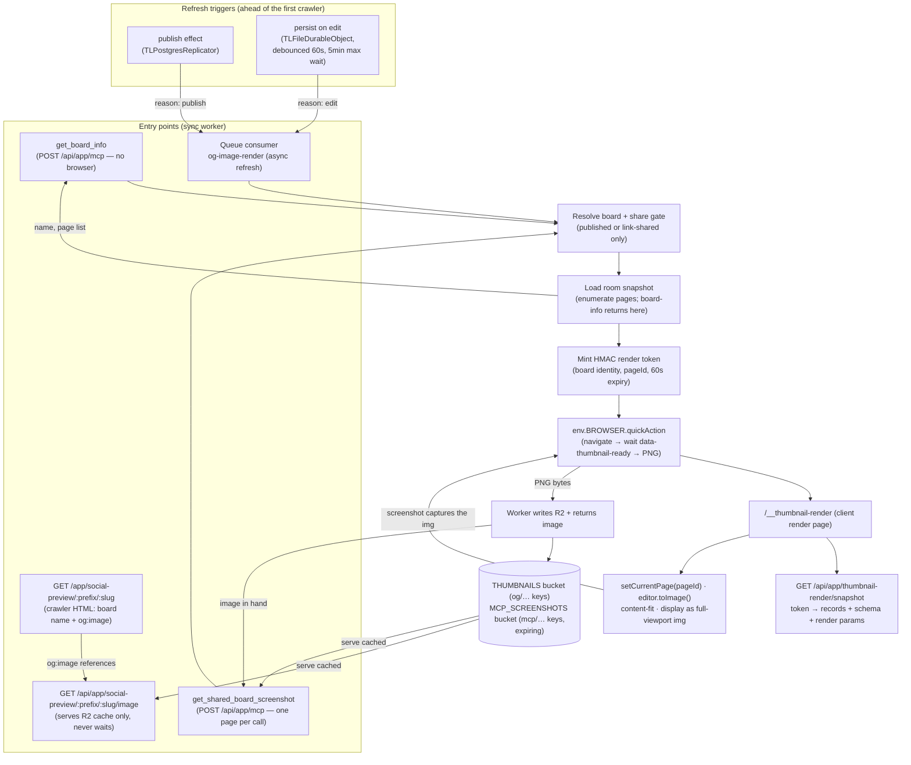
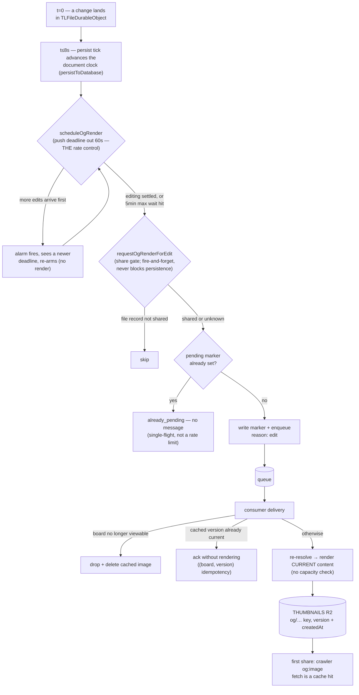

# Browser Run thumbnails and MCP screenshots

Issues:

- <https://github.com/tldraw/tldraw/issues/9502>
- <https://github.com/tldraw/tldraw/issues/9497>

tldraw.com can capture PNG thumbnails of public boards by taking a Cloudflare Browser Rendering `/screenshot` of a tldraw-owned render page, called straight through the `BROWSER` binding's `quickAction` Quick Actions method — no `@cloudflare/puppeteer` and no API token (requires `compatibility_date >= 2026-03-24`). There are two consumers, both served by the sync worker:

- an MCP server at `POST /api/app/mcp` exposing two tools: `get_board_info` lists a board's pages (name, 0-based index, and whether each has content), and `get_shared_board_screenshot` returns a content-fit PNG of a single page. Each screenshot renders exactly one page, so an agent lists pages first and then requests the ones it wants; and
- a board OG image endpoint, `GET /api/app/social-preview/:prefix/:slug/image`, built for high-traffic paths (link unfurls, crawlers): it serves only from the R2 cache and delegates rendering to a queue consumer, so a request never waits on Browser Run. It lives under the `social-preview` route family alongside the crawler HTML that references it.

Rendering runs through the Browser Rendering `/screenshot` Quick Action, invoked from the worker via the `BROWSER` binding's `quickAction` method (`env.BROWSER.quickAction('screenshot', …)`). Chrome runs in Cloudflare's Browser Rendering fleet, not in the worker isolate. The pipeline never hands the browser a user-provided URL: the worker resolves the board, mints a short-lived signed render job, and the screenshot only ever targets the internal render page with that token. **Rendering is not gated on public viewability — serving is.** A thumbnail is generated for every board, private ones included, so that an owner-facing surface has one to show; the OG image route re-applies the public gate on every request. See "Rendering every board" below for what that means for the render token. The MCP surface exposes page metadata (names, counts) and page screenshots only: no document structure, shape listing, arbitrary selectors, arbitrary URLs, or access to files that are not publicly shared.

## Architecture

1. A client calls `get_shared_board_screenshot` with a board id — the `:slug` of a published board (`https://www.tldraw.com/p/:slug`) or of an anonymously-shared file (`https://www.tldraw.com/f/:slug`) — a 0-based `page` ordinal (default 0), and an optional theme (default light). It usually calls `get_board_info` first to discover the board's pages.
2. The sync worker resolves the id as a shared file first and as a published-board slug second, so callers never need to know which kind of board they hold. Shared files resolve the id directly as the `file.id` (`getSharedFileInfo`) and must pass the same anonymous-view gate the live file room enforces: the file exists, is not deleted, and is `shared` via link (`isFileAnonymouslyViewable`). `sharedLinkType` (`view` vs `edit`) is irrelevant to viewing; test-slug files are refused because they require admin auth the anonymous tool never has. Published boards resolve through the `file` row (`getPublishedFileInfo`) and must be published. Unknown, unpublished, or private boards fail without spending any Browser Rendering capacity. This is the `access: 'public'` gate; the render path uses a weaker one — see "Rendering every board".
3. The worker builds a per-page R2 cache key from board identity, a content version, the fixed 1200x630 output size, theme, and the page ordinal (`mcp/{kind}/{slug}/{version}/1200x630/{theme}/page-{n}.png`), with the page name in object metadata. The version is the file's `lastPublished` for published boards and the persisted room snapshot's R2 etag for shared files, so republishing or editing rotates every page's key. A cache hit in the `THUMBNAILS` bucket returns immediately — without even loading the board snapshot, since the ordinal alone keys the object and the page name rides in its metadata.
4. On a miss, the worker loads the board's room snapshot to resolve the ordinal to a real page (its `TLPageId` and name) and to validate the range, then mints an HMAC-signed render token (`renderTokens.ts`) carrying the board identity, that `pageId`, and render parameters, expiring in `THUMBNAIL_RENDER_TOKEN_TTL_MS` (60s). Page enumeration is capped at `MAX_THUMBNAIL_PAGES` (40), so `pageCount` and the addressable ordinals stop there on very large boards. The snapshot route re-checks that `pageId` still exists at render time: a page deleted inside the token's window fails the render rather than returning a different page's image under the original page's name.
5. The worker calls the Browser Rendering `/screenshot` Quick Action through `env.BROWSER.quickAction`, targeting `{MCP_SCREENSHOT_RENDER_ORIGIN}/__thumbnail-render?token=...`. The render page (`apps/dotcom/client/src/pages/thumbnail-render.tsx`) exchanges the token for snapshot data at `GET /api/app/thumbnail-render/snapshot`, which verifies the signature and expiry before returning records, schema, and render params. Published boards read a frozen R2 snapshot; shared files read the live persisted room snapshot from R2 (`env.ROOMS`) and re-check their gate here, not just when the token was minted, so a board deleted during the token's window stops resolving. The page selects the requested `pageId`, content-fits it with margins once fonts and image assets have settled, exports it with `editor.toImage`, and then displays that PNG as a full-viewport `` and sets `data-thumbnail-ready` — so the screenshot captures the exact export rather than the live editor canvas. Any failure (bad token, snapshot load, export, image decode) sets `data-thumbnail-error` instead. The Quick Action waits for _either_ terminal marker and captures `body[data-thumbnail-ready="true"]`, which only exists on the success path — so a failed render returns as soon as it errors rather than holding Browser Run capacity for the whole timeout. The render and settle budgets (`THUMBNAIL_RENDER_TIMEOUT_MS` 45s, `THUMBNAIL_SETTLE_TIMEOUT_MS` 10s) live in `@tldraw/dotcom-shared` so the worker's deadline and the page's can't drift.
6. The screenshot response body is the PNG bytes. The worker writes them to the page's cache key in R2 (for future hits) and returns two MCP content items: a text item with the page name, followed by the image.

### OG images (queue-backed async rendering)

`GET /api/app/social-preview/:prefix/:slug/image` (`:prefix` is `p` for published boards or `f` for shared files) serves a 1200x630 light-theme, content-fit PNG for use in `og:image` tags. The crawler HTML that references it is the existing worker route `/app/social-preview/:prefix/:slug` (`getSocialPreview`, which Vercel routes crawler user-agents to), which puts the board name in the title and bounces human visitors back to the board. It only emits the board `og:image` (and `summary_large_image`) when the board resolves through the same gate the image route applies; for private, deleted, or unpublished boards it names the static site-wide preview image directly, since pointing at a board image route that has nothing to serve would only cost the crawler a redirect to reach the same file. The request path never invokes Browser Run:

The route is a **pure read** — two questions and nothing else:

1. **Is the board publicly viewable?** Resolved through the same gate as the MCP tool: published, or shared via link. Private, deleted, unpublished, or unknown boards get the default tldraw OG image (see the fallback below). This is checked on every request, which is what keeps an unshared board's image unreachable even though the image itself is never deleted.
2. **Does a thumbnail exist?** If so it is served, whatever its state, with `max-age=300` and the object's etag. That is the only thing the version affects — a mismatch is logged as `stale` and served anyway, because an old picture of the board beats the generic tldraw logo, and there is no "too stale to serve". Otherwise, the default-image fallback with `max-age=60`.

**The lifetime is chosen from the share gate, not from cost or freshness.** R2 reads are a rounding error next to rendering, and unfurl platforms cache a card their own side for days whatever we send, so neither pushes the number around. What the lifetime does decide is how long an image can be served without the gate in step 1 being consulted — and since nothing deletes a board's image when it stops being public, that gate is the only thing keeping an unshared board's thumbnail off the internet. So it is minutes rather than the hour it used to be, `stale-while-revalidate` is absent (it would extend serving a day past expiry, the same objection the default-image redirect already answers), and an `etag` with `if-none-match` support makes the resulting revalidations cheap: a cache that still holds the current bytes gets a 304, and every one of those re-runs the gate.

The route is registered with `.all`, because crawlers probe with HEAD before (or instead of) GET: a HEAD gets the same cache headers from an R2 `head` but never reads the body.

**It has no rate limiting, and it enqueues a render in exactly one case.** It used to do both generally. The general enqueue was pointless in the way that matters: unfurl platforms resolve a URL's card once and reuse it for every repost, so the crawler that triggered the render has already cached the default by the time the render lands — a viral link can be fetched once and shown thousands of times, and none of those views come back here. The render was real work whose result nobody fetched. Making the image exist _before_ the board is ever shared is the job of the publish and edit triggers below, not of the request that discovers it missing. With that gone, the per-board limit and the one-hour minimum refresh age that bounded it went too, along with `getOgImageAge`.

What remains is a **repair for published boards with no image at all** (`repairMissingPublishedImage`), and it exists because the two kinds are not symmetric in how many triggers they have. A shared file re-asks on every persist that advances its document clock, so an ask lost to a queue failure or to a pending marker left behind by an earlier one is made good by the next edit. A published board has exactly one trigger — the publish effect — and its snapshot is frozen, so nothing ever edits it into asking again: one lost ask leaves that board's card generic until somebody republishes. The repair fires only on a total miss (never on a stale image), only for `published`, on HEAD as well as GET since some crawlers only ever probe, and is deduped by the pending marker so a board that cannot render is limited to one attempt per marker TTL rather than one per crawler. It does not contradict the paragraph above — it is not trying to serve the request that triggers it, it is being the thing that asks when nothing else will.

3. The queue consumer (`ogImageQueue.ts`, dispatched from the worker's `queue()` handler) re-resolves the board at render time under `access: 'render'`: a board deleted or unpublished while queued is dropped without rendering, an unshared one still renders (see "Rendering every board"), and the version is re-read so bursts of enqueues coalesce into one capture of the newest content. It loads the snapshot to pick the first page that _has content_ (so a board with an empty first page still unfurls with a meaningful image), mints a render token with `camera: 'content'` and that `pageId`, screenshots it through the same `env.BROWSER.quickAction` path as the MCP tool, and writes the PNG to the cache key the route reads. If the snapshot can't be read it fails there and then rather than paying for a capture that would fail on the render page for the same reason. Genuine transient failures retry up to three times with backoff, then drop. There is no capacity check: thumbnail rendering is uncapped (see "Request limits").

#### Default-image fallback

A board with no usable cached image is sent to the site-wide default (`/social-og.png`, 1200x630, the size the `og:image:width`/`height` meta advertises) with a **302**. The worker does not proxy those bytes: the default is a static asset on the client origin and already cached at the edge, so serving it here would put worker egress in front of every unfurl of an unrendered board. The redirect carries `cache-control: public, max-age=60` with no `s-maxage` and no `stale-while-revalidate`, so nothing pins it under a board's permanent image URL once the real render arrives. Telemetry records it as `not_rendered_yet`.

**The cost is a generic card, not a broken one.** The crawler follows the redirect and gets a valid image — the tldraw logo rather than the board — and then caches that card for days. So what matters is not how the empty case renders but how often it is reached, which is what the publish and edit triggers are for. What remains exposed is a board shared within the debounce window of its first edit, or one dormant since before this shipped.

### Keeping the thumbnail current

Nothing renders on crawler demand any more, so a board's thumbnail has to exist before its first share. Two triggers make that happen, both enqueueing onto the same queue and consumer, and both subject to the same re-resolve and version check at render time. Every queue message carries a `reason` (`publish`, `edit`) that rides through to telemetry; `crawler` survives in the union only as the fallback for messages enqueued before the field existed.

- **Publish.** The `publish` effect in `TLPostgresReplicator` enqueues a render right after `publishSnapshot` writes the frozen R2 snapshot, so a published board's image is being made before its link is pasted anywhere. `unpublish` deletes the cached image and pending marker instead — the one replicator effect that touches a thumbnail. **Unsharing has no effect of its own**: every board renders whether shared or not, and the share gate is applied at serve time, so there is nothing derived from a board's public state to tear down when it goes private.
- **On edit.** `TLFileDurableObject.persistToDatabase` schedules a render on a persist that actually advanced the document clock. The only states that skip are `legacy` and `deleted` (see "Rendering every board"); shared and private boards both render. There is no sampling and no staleness window — a persist means the board's saved content genuinely differs from what the cached thumbnail shows, which is exactly when a re-render is warranted.

  **The ask is debounced, not throttled.** Each persist pushes the render deadline out by `OG_RENDER_DEBOUNCE_MS` (60s), so a board renders once its editing _settles_ rather than on a cadence while it is still being drawn on — which is what a thumbnail is for. `OG_RENDER_MAX_WAIT_MS` (5 minutes), measured from the first persist since the last render, stops a board that is never left alone from never rendering. The arithmetic lives in `utils/ogRenderDebounce.ts` so it is testable without standing up a durable object; the object supplies the clock and the alarm.

  **The durable alarm is the deadline**, not an approximation of it. Every persist re-arms it, so the two can never disagree and an eviction loses only the in-memory copy: the alarm still fires at exactly the time the debouncer chose, and the board renders once, when it should.

  This replaced a cheaper scheme where the deadline moved in memory and the alarm was left where it was, re-arming itself on each fire. That wrote storage about once per debounce window instead of once per persist, but it meant the alarm was only a _lower bound_ on the deadline — so an evicted object woke early, rendered, and then rendered again when editing actually settled. The cost moved rather than grew: an alarm write per persist (7.5/min for a continuously edited board), against far fewer alarm **invocations**, since the alarm no longer fires mid-session purely to push itself further out. Ten minutes of unbroken editing goes from ~20 wake-ups to 2 — the two renders themselves. `ogRenderDebounce.test.ts` pins both halves.

  `pendingSince`, the max-wait anchor, is still in memory only. Losing it to an eviction restarts the five minute window, which can delay a render but never duplicate one.

- **The debounce is the rate control; the pending marker is not.** `PENDING_MARKER_TTL_MS` (5 minutes) reads like a render interval but isn't one — the consumer deletes the marker as soon as a render lands, so on a healthy board it never lives out its TTL. It is a single-flight that stops a second ask being queued while one is in flight, plus a crash ceiling. The TTL is sized above a job's worst-case retry chain (three captures at the full 45s timeout plus 30s and 60s of backoff, ~3.75 minutes) so the marker cannot lapse while its job is still alive — a lapse would let a second job for the same board overlap the first and clobber its render token record. A test pins that inequality. To change how often a board renders, change the debounce.

  **The marker drops asks rather than deferring them,** which matters because nothing upstream retries one. The debouncer resets the moment it fires and neither caller reads the enqueue result, so an ask turned away is simply gone. A capture takes seconds, so an edit landing during one hits this: without help, the board would keep a thumbnail of its before-the-last-edits state until something happened to ask again.

  Two things cover it. A **retry** needs nothing — every delivery re-resolves before capturing, so a later attempt picks up the newest content by itself. A **completed render** re-resolves afterwards and enqueues a follow-up if the version moved under it (`enqueueFollowUpIfBoardMoved`). A job that gives up permanently clears the marker rather than letting it lapse, so the next ask is acted on immediately.

  Follow-ups deliberately **do not chain**: a board edited without pause is stale at the end of every capture, so chaining would render it continuously — the exact cost the debounce exists to avoid. The ceiling is one extra render per triggered render. The residue is narrow and known: if editing stops such that the final debounce fire lands inside a follow-up's capture window, that last ask is swallowed and nothing re-asks, so the board keeps a nearly-settled thumbnail until its next edit.

#### Why a debounce and not a throttle

This started as a 30s leading-and-trailing throttle. Measurement killed it. Production runs **~555 persists/min across ~359 boards active in a 10 minute window** — a mean gap between a given board's persists of roughly **39 seconds**, which is _longer_ than the 30s window. A throttle whose window is shorter than the gap between events suppresses almost nothing: its leading edge fired on nearly every persist, so render volume tracked persist volume rather than the interval it was nominally set to.

The debounce is a better fit in shape as well as cost. Cost, for a board edited without pause (verified in `utils/ogRenderDebounce.test.ts`):

| Mechanism                        | Renders per 10-minute editing session | Isolated burst |
| -------------------------------- | ------------------------------------- | -------------- |
| None                             | 76                                    | 1              |
| 30s throttle                     | ~20                                   | 1–2            |
| 1/min rate limit                 | 10                                    | 1              |
| **60s debounce + 5min max wait** | **2**                                 | **1**          |

Note the right-hand column: on a bursty board — which the 39s mean gap says is the common case — every mechanism costs the same one render. The debounce is not a saving there; it is a saving on the heavy tail of sustained editing, and it renders the _finished_ burst rather than its first stroke.

Sizing what remains: Browser Run allows 60 new browser instances per minute per account. With a debounce, spend scales with **editing sessions**, not persists and not wall-clock windows, so the quantity to forecast is distinct shared boards starting an editing session per minute. Both inputs — the link-shared fraction `f` and the session shape — now ride on `persist_success` (`blob3` and `index1`), so they are Analytics Engine questions rather than database ones. See "Open questions", and "What it costs" for what the answer is worth in dollars.

### Request limits

Thumbnail rendering has **no global cap**, deliberately. It is our own derived artifact, triggered by things that already happened (a publish, an edit persisting) rather than by anything a caller can drive, so a global rate limiter there would only ever mean "serve a stale thumbnail to save a render we intend to do anyway". The queue consumer performs no capacity check at all.

What bounds it instead is per-board: the render debounce in front of the edit trigger (`OG_RENDER_DEBOUNCE_MS`, with `OG_RENDER_MAX_WAIT_MS` as its ceiling). That is a freshness rule rather than a budget — it does not know or care what the rest of the system is spending — so total thumbnail spend scales with the number of boards being edited at once. See "Keeping the thumbnail current" for how it is sized against Browser Run's account limits, which are now the real ceiling.

Worth being explicit that **no per-board mechanism can cap total spend**, because total is `active boards × per-board rate`. Cloudflare's rate limit binding cannot close that gap either: limits are applied per Cloudflare location, so a single global key gives `limit × locations`, not `limit`. (The same caveat applies to the MCP global cap below — `GLOBAL_BROWSER_RUN_RATE_LIMIT = 20` is really 20/min per colo. It bounds a rogue caller, which is its job, but it is not an account-wide spend ceiling.) The levers that actually bound the total are Browser Run's own account limits and raising them.

The limits below are therefore the **only** rate limiting in the pipeline, and they exist for the **MCP endpoint** specifically — the one Browser Run-spending surface an outside caller can drive directly, where a rogue or looping agent is the threat being bounded. They live in `sharedBoardScreenshotMcp.ts`, not in the shared render core, so a new surface built on those helpers cannot pick one up by accident:

- Per IP: ~10 `get_shared_board_screenshot` calls per minute (`ip-shot:` on `MCP_SCREENSHOT_RATE_LIMITER`).
- Per board: ~2 Browser Run captures per minute (`board:` on `MCP_SCREENSHOT_BOARD_RATE_LIMITER`), applied only on cache misses.
- Global: ~20 Browser Run captures per minute across all MCP callers (`MCP_SCREENSHOT_BROWSER_RATE_LIMITER`, key `global`).

Per-board is deliberately far tighter than per-IP: a caller gets 10 captures a minute, but no single board may absorb more than 2 of them. Because captures are counted only on cache misses, this does not bound the usual "screenshot several pages of one board" flow — a repeated capture of the same page is a cache hit.

That gap is only expressible because each budget has **its own binding**. A binding carries a single `limit` applied per key, so two budgets wanting different numbers cannot share one however distinct their keys are. Per-IP and per-board shared `MCP_SCREENSHOT_RATE_LIMITER` while both were 2, which made them look separable when they were not; per-board moved to `MCP_SCREENSHOT_BOARD_RATE_LIMITER` (`namespace_id` 1013–1016) when they diverged.

Two things to know when changing any of these. The numbers live in **two places that must move together** — the constants in `sharedBoardScreenshotMcp.ts` are only the isolate-local fallback for local dev and tests, and every deployed environment is governed by the Cloudflare binding in `wrangler.toml`, so editing one alone changes nothing where it matters. Unit tests run with no bindings at all, so they pin the fallback constants and can never catch a wrong or shared binding; `wrangler.toml` is the only place to check that. And `period` in those bindings [must be either 10 or 60 seconds](https://developers.cloudflare.com/workers/runtime-apis/bindings/rate-limit/) — that restriction is on the window, not on `limit`, which is an unconstrained integer. All of these use `period = 60`.

Only the calls that actually spend Browser Run are limited. `get_board_info` is not: it resolves a board and reads its snapshot, which is the same work the ordinary board routes already do for anyone. It previously held its own per-IP budget (`ip-info:`), kept separate from the screenshot one so the usual "list once, then screenshot pages" flow could not burn its allowance on the free call; that budget is now simply absent. The OG image route's per-board limit (`og-board:`) is gone too, along with the route's enqueue — see "OG images (queue-backed async rendering)" above.

The Cloudflare rate limit bindings are declared in `wrangler.toml` for every environment. When a binding is absent (local dev, tests) the route falls back to an isolate-local guard with the same limits. Changing the global cap means moving the `MCP_SCREENSHOT_BROWSER_RATE_LIMITER` bindings in `wrangler.toml` (one per environment) and the isolate-local fallback constant `GLOBAL_BROWSER_RUN_RATE_LIMIT` in `sharedBoardScreenshotMcp.ts` together.

The thing to watch instead of a cap is Browser Rendering's own account limits: a render can hold a session for the full 45s `THUMBNAIL_RENDER_TIMEOUT_MS`, so sustained edit volume is bounded in practice by concurrent-session and new-session-per-minute limits rather than by anything in this worker. Browser Rendering bills by browser duration, so thumbnail spend now scales with editing activity. `fetch-screenshot-metrics.ts` (below) is how that gets watched.

### What it costs

Quick Actions bill [**duration only**](https://developers.cloudflare.com/browser-run/pricing/) — $0.09 per browser hour beyond the 10 hours a month Workers Paid includes. The per-concurrent-browser charge applies to Browser Sessions, which this pipeline does not use, so concurrency is a limit here rather than a line item. A capture that fails on a `waitForTimeout` is not charged at all, which means telemetry's wall-clock `double3` is an upper bound on the bill rather than the bill.

**What it costs today, measured.** The Browser Run dashboard (Compute > Browser Run) for July 2026: **15.22 browser hours across 8.75k Quick Action requests**, all of them `Screenshot` against `www.tldraw.com/__thumbnail-render`, no Browser Sessions at all. Volume was near zero until about July 20 and has run at **~1,000 captures and 1.6–2.6 browser hours a day** since — call it **0.7 renders/min**, against a **$0.47** bill for the month and a **$4–6/month** run rate if that holds. This is the pre-branch pipeline: the edit trigger is not deployed, so what is being measured is publish- and crawler-driven rendering only.

**Those hours are all thumbnails.** Browser Run reports one account-wide figure that both surfaces land in, but the buckets separate them: `mcp-screenshots-preview` holds **0 objects**, and the production `mcp-screenshots` bucket does not exist yet. Since every MCP capture writes exactly one object and its key carries the board's content version, an empty bucket is an unused surface — so the whole 8.75k is the OG pipeline, and the MCP tool's share of the bill is currently zero. That also makes the object count the standing way to split the two later: MCP captures over the last 30 days are just the object count in that bucket, since the lifecycle rule expires them on exactly that schedule.

The useful number that falls out of it is the **mean capture: 6.3 seconds** (15.22h / 8.75k). That is what the forecast below is priced at, rather than an assumption, and it is worth re-deriving the same way whenever these figures move — two dashboard numbers divided by each other.

At that 6.3 seconds, one render is **~$0.00016 of browser time** and **~$0.000018 of everything else**: three R2 class A writes (the pending marker, the render token record, the PNG — deletes are free), roughly seven class B reads across resolve, cache check, snapshot load and token check, three queue operations, and a couple of worker requests. So ~$160 per million renders against ~$18 for the machinery around them, and the only quantity worth forecasting is the render count.

**Renders scale with editing sessions, and the session shape is now measured.** [PR 9708](https://github.com/tldraw/tldraw/pull/9708) put `index1` (the durable object id) on every file DO event in production, which is exactly what open question 2 needs: `persist_success` rows carry a per-board key, so a board's persists can be bucketed by time and the runs between them counted. Replaying the debounce's own rules over a 30 minute production window (`blob1 = 'persist_success'`, `blob2 = 'production-tldraw-multiplayer'`, grouping by `index1`, splitting a board's persists wherever the gap exceeds `OG_RENDER_DEBOUNCE_MS`, and adding one render per `OG_RENDER_MAX_WAIT_MS` a run survives):

| Quantity                                    | Measured                                  |
| ------------------------------------------- | ----------------------------------------- |
| Boards persisting in the window             | 553                                       |
| Persists                                    | 521/min (independently confirms the ~555) |
| Editing time                                | 69.5 board-minutes per minute             |
| **Renders — sessions settling**             | **34–51/min**                             |
| **Renders — `OG_RENDER_MAX_WAIT_MS` fires** | **0.3–4/min**                             |
| **Total**                                   | **~37–51/min, ~54,000–74,000/day**        |
| Browser hours/month                         | 2,800–3,900                               |
| **Browser Run $/month**                     | **$250–350**                              |

The range is sampling, not uncertainty about the mechanism: Analytics Engine thins high-volume indexes, and a thinned timeline splits runs that were really continuous, so the raw count is an upper bound. The low end divides each board's gaps by its own `_sample_interval` before applying the 30 second rule. Both ends assume nothing — they are the branch's constants applied to production timings. **Call it $250–350/month and plan against ~$300.**

Two things fall out of the measurement that the model got wrong:

- **Renders per persist is 0.07–0.10.** The debounce suppresses about 90% of persists, which is the claim in "Why a debounce and not a throttle", now with a number on it.
- **Editing is far more fragmented than assumed.** The median session spans **8–12 seconds** and the p90 spans 86–216 seconds; in a 10 minute window, 105 of 251 persisting boards persisted exactly once. Sessions are short bursts, not the multi-minute stretches the estimate assumed, which is why the render count is close to one per board-editing-visit.

One caveat on the figure: `persist_success` on `main` carries no `sharedState`, so these counts include `legacy` and `deleted` rooms that the trigger skips. The measurement is an over-count by that fraction, and this branch's `blob3` is what nets it out.

#### The two constants only work as a pair

The same replay run over six hours (3,507 boards) against a grid of both constants, in renders/min and Browser Run $/month:

| Debounce ↓ / max wait → | 5 min           | 10 min      | 15 min      | off         |
| ----------------------- | --------------- | ----------- | ----------- | ----------- |
| 30s                     | 35.7 · $240     | 32.1 · $216 | 31.3 · $211 | 30.5 · $205 |
| **60s (current)**       | **32.3 · $218** | 26.7 · $180 | 25.1 · $169 | 23.3 · $157 |
| 120s                    | 32.0 · $215     | 24.4 · $164 | 22.0 · $148 | 19.0 · $128 |

Read along the first column: at a 5 minute max wait, quadrupling the debounce from 30s to 120s saves almost nothing (35.7 → 32.0). The reason is mechanical — merging two bursts into one longer session pushes that session past `OG_RENDER_MAX_WAIT_MS`, so a settle render is traded for a max-wait render, and `OG_RENDER_MAX_WAIT_MS` puts a floor under what the debounce alone can achieve. The savings live on the diagonal: 60s with a 10 minute max wait is ~25% fewer renders, 120s with 15 minutes is ~38% fewer.

The debounce is at 60s and the max wait stays at 5 minutes, which buys roughly 10%. That is a deliberate choice rather than the cheapest point on the grid: a board edited without pause keeps a five minute old thumbnail rather than a ten minute old one, and the cheaper cells are available whenever spend matters more than that.

**Raising the account limit is still worth doing, and the grid is why.** Browser Run allows 60 new browsers/min. The mean is ~32 renders/min at the current constants, but the limit applies per minute and the distribution has a tail: p99 is ~47/min and the busiest minute observed reached 71–75/min — most likely a wave of rooms persisting together after a deploy or an eviction, which is exactly the shape that breaches a per-minute limit. `enqueueFollowUpIfBoardMoved` adds up to a tenth on top of all of it. So the debounce change moves the mean but barely touches the peak, and the peak is what the limit sees. Past the limit the spend stops growing and the failure rate starts — a rejected render retries three times holding its pending marker, so overload amplifies rather than backs off. **Ask for the increase before the deploy**, and watch renders/min against 60 from the first hour.

**Render page egress is plausibly larger than the browser time, and is not Cloudflare's.** Every capture is a cold browser loading `/__thumbnail-render` from the client origin: the lazy route chunk, the editor bundle, fonts, and whatever image assets the board contains. At a nominal 2 MB transferred that is ~2 TB and a few hundred dollars per million renders — so at the measured ~60,000 renders/day it is ~3.6 TB and **~$540 a month, more than the browser time itself**, and on a different bill. The transferred size of one render is worth measuring before trusting the magnitude, and it is the one cost that can be cut without touching thumbnail freshness.

Two smaller lines, both fixed rather than per-render:

- **~$24/month of durable object alarm writes.** `scheduleOgRender` calls `setAlarm` on every persist and [each `setAlarm` is one row written](https://developers.cloudflare.com/durable-objects/platform/pricing/#sqlite-storage-backend) — ~24M rows/month at $1.00/M. This is the cost the alarm-is-the-deadline design deliberately took on, and it is paid whether or not a render results. See "Keeping the thumbnail current" for what it buys.
- **R2 storage is a rounding error.** The `og/…` keys carry no version, so it is one object per board: the production `thumbnails` bucket currently holds **4.71k objects in 404 MB** (~86 KB a thumbnail, plus the zero-byte markers and token records), which is well under a cent a month. Growth is bounded by board count rather than by render volume, so rendering every board on every edit does not move this line. The `mcp/…` keys do accumulate, which is what their expiration rule is for.

The MCP surface prices separately, since it is driven by callers rather than by editing: at the full `GLOBAL_BROWSER_RUN_RATE_LIMIT` of 20 captures/min it is ~$135/month, and because Cloudflare rate limits apply per location that is per colo. It bounds a rogue agent, which is its job; it does not bound spend.

If this needs to come down, in order of leverage: shrink what the render page loads, which is the largest line and costs no freshness at all; then raise `OG_RENDER_MAX_WAIT_MS` alongside the debounce, since the grid above says neither constant does much alone; then cap the render rate outright with the dedicated queue described in "Follow-up work". Prioritising by `sharedState` — a longer debounce for private boards than for shared ones — is the option that goes below the floor of one render per board-editing-visit without capping anything, and the durable object already knows which is which at trigger time.

### Telemetry and monitoring

All three surfaces write `mcp_shared_board_screenshot` events with the same blob layout, so one dashboard covers everything; the source blob distinguishes `mcp` (the tool), `og` (the OG image route), and `queue` (the async consumer). Events record cache hit/stale/miss, render duration (wall-clock around the browser session), output dimensions, failure reason, rate-limit decisions, a hashed IP, and the trigger that asked for the render. They carry **no board identity at all** — no index, no slug, no hash, no derived id (see below). Two dimensions are deliberately kept low-cardinality: the failure reason is always a bounded reason code (`invalid_input`, `not_found`, `board_empty`, `no_pages`, `page_out_of_range`, `rate_limited_ip`/`board`/`global`, `board_not_viewable`, `not_rendered_yet`, `browser_failed`, `browser_timeout`, `empty_render`, `not_configured`, `render_error`), never raw `error.message` text; and the hashed IP is written only on failed or rate-limited events (where it's useful for abuse analysis) — successful events carry `ip:none`, so the per-client IP dimension never lands on the common success path. Column layout in the Analytics Engine dataset (`MEASURE`): `blob1` event name, `blob2` worker name, `blob3` source, `blob4` cache status, `blob5` failure reason, `blob6` rate-limit decision, `blob7` hashed IP (or `none`), `blob8` render trigger (`crawler`, `publish`, `edit`, or `none` on the surfaces that have no trigger), `double1`/`double2` output width/height, `double3` render duration ms, `double4` browser ms used, `double5` rate-limit allowed (1/0), and no `index1`. (The `quickAction` screenshot response includes an `X-Browser-Ms-Used` header, but the worker does not currently read it — telemetry uses wall-clock render duration in `double3` as the spend proxy and writes `double4` as -1. Wiring the header into `double4` is a possible follow-up.)

One event outside that dataset matters for sizing: `persist_success` (same `MEASURE` dataset, written by `TLFileDurableObject.logEvent`). It fires on exactly the event that triggers a thumbnail render, so it carries what sizing that render needs: `index1` the **durable object id**, `blob3` the board's `sharedState` (`shared`, `private`, `unknown` for an app file whose record hasn't loaded, `legacy` for a non-app room, `deleted` for a deleted file), and `double1` the retry attempt count. It is written by `getBoardRenderState`, the same method that gates the render, so a board the trigger skips can never be counted as one it renders.

The index is stamped centrally in `writeEvent` for every file DO event, not per call site. Analytics Engine samples by index, so a board that persists rarely keeps data points instead of being sampled away inside the volume of a busy one, and since it has no `uniq()`/`count(distinct)`, distinct boards means `GROUP BY index1` and counting the returned rows.

It is the durable object id rather than the board slug on purpose: `idFromName` is one-way, and for an app file the slug _is_ the authority of `tldraw.com/f/<id>`, so writing it to an account-readable dataset exported to Grafana would put working capabilities in telemetry. Resolving in the useful direction still works from a slug you already hold, via `env.TLDR_DOC.idFromName('/r/' + slug)`.

Only `persist_success` carries that index. The screenshot events deliberately carry none (see "No board identifier leaves this pipeline"), so the two datasets cannot be joined and renders-per-persist is two aggregate counts divided by each other rather than a per-board number.

The one-way-ness is also why `sharedState` has to be recorded at write time rather than recovered later: the dataset cannot be joined back to a file row. Postgres could not answer it anyway — it knows which files are shared, not which are being edited. See "Open questions".

Bounded reason codes say _that_ a board stopped rendering, never _why_, and every one of these surfaces deliberately swallows its own errors (the OG route falls back to the default image, the snapshot route 404s, the MCP tools return a tool error, the queue retries or drops). So each swallow point also reports the underlying error to Sentry through `reportThumbnailError` (`thumbnailShared.ts`), tagged `thumbnail_surface` with a closed set of values: `og_route`, `og_queue`, `thumbnail_snapshot`, `mcp_board_info`, `mcp_screenshot`. Reporting rides on the handler's `waitUntil` and is itself failure-proof — a missing Sentry env var must never turn a degraded-but-fine response into a 500.

#### No board identifier leaves this pipeline

**No board identity is written anywhere** — not to telemetry, not to a log line, not to a Sentry event. Not the slug, not a hash of it, not a derived durable object id. For a link-shared file the slug _is_ the file id, and `tldraw.com/f/<id>` is the capability to view a board somebody chose to share by link rather than publish; a one-way derivation avoids handing that out, but it is still a per-board dimension in an account-readable dataset, so the simplest guarantee is to record none.

Three routes out, and the third was the sharp one:

- **Telemetry** writes no `index1`. It briefly carried the board's durable object id so renders could be joined to the `persist_success` events that caused them; that join is gone deliberately, and with it the ability to say which board is failing from the dataset alone. These datapoints answer aggregate spend and failure-rate questions.
- **Sentry extras** carried raw `slug`/`boardId` at six call sites, then briefly a derived id. They now carry neither — only `kind`, `prefix`, `page`, `theme`, `attempts` and the like.
- **The request object** is no longer handed to `createSentry` at all. It passes one straight to Toucan with `allowedSearchParams: /(.*)/`, which records the full URL and every query parameter — and on these routes the URL is the sensitive part. `/app/social-preview/f/<id>/image` carries a link-shared file's id in its path, and `/api/app/thumbnail-render/snapshot?token=…` carries a signed render token, which is a live capability to read that board's entire snapshot until it expires. `reportThumbnailError` now takes only the method and user agent from the request; the `thumbnail_surface` tag already says which endpoint it was.

`TLFileDurableObject`'s render log had the same issue and now logs only the enqueue result — no slug and no derived id.

#### Reading a Browser Run failure

`422 Unprocessable Entity` is the status to expect from a failed capture, and on its own it says almost nothing. Cloudflare answers 422 for [every "the page did not cooperate" outcome](https://developers.cloudflare.com/browser-run/faq/): a page that crashed, a render that exhausted the container's memory, and any of the [Quick Action timers](https://developers.cloudflare.com/browser-run/reference/timeouts/) expiring. Our own render page marking `data-thumbnail-error` arrives as one too, because the capture selector (`body[data-thumbnail-ready="true"]`) exists only on the success path — that is the design working, and it is indistinguishable by status from the cases that aren't.

What separates them is the response body, so `renderThumbnailScreenshot` reads it and throws a `BrowserRenderError` carrying the status, Cloudflare's own message (its `errors[].message`, truncated), the wall-clock duration, and the timeout budget. Two things follow:

- **`classifyScreenshotFailure` splits 422 into `browser_timeout` and `browser_failed`** from that body, falling back to "did the call spend essentially the whole budget" when the body names no timer. It used to classify on `error.message` alone, which for a Browser Run failure never contains the word "timeout" — so every timeout was filed as `browser_failed` and the dashboard's timeout rate was structurally always zero.
- **The specifics reach Sentry as event context, not as the message.** Sentry groups on the message, so it stays exactly `Browser Rendering screenshot failed (<status>)` and the varying parts ride on `browser_render_status`, `browser_render_detail`, `browser_render_duration_ms`, `browser_render_timeout_ms`, and `browser_render_reason`. Putting the detail in the message would shatter one recurring issue into a stream of new ones.

The queue consumer reports **once per job, on the delivery that gives up**, rather than once per delivery. A board that fails deterministically fails all `MAX_RENDER_ATTEMPTS` times, so per-delivery reporting filed three events for one problem. A failure that recovers on retry now reports nothing, which is correct — the render landed.

Telemetry goes the other way on purpose: **one datapoint per delivery, and a failed capture records its duration in `double3` like a successful one.** The split is that telemetry counts spend and Sentry counts problems — three deliveries are three lots of Browser Run and one problem. This used to write nothing at all on the retried deliveries and `-1` for the duration on the final one, so a failing board's spend was invisible on a path that has no cap and is watched only by this dataset. A delivery that bails before the capture (an unreadable or empty snapshot) still records `-1`, because it genuinely spent nothing.

If timeouts turn out to dominate, the knob Cloudflare points at is `actionTimeout` (default none, max 5 minutes), which bounds the capture itself rather than the page load; it is not currently set in `getThumbnailScreenshotRequestBody`.

`internal/scripts/fetch-screenshot-metrics.ts` queries the Analytics Engine SQL API and reports request volume, failure rate, timeout rate, cache hit rate, rate-limit blocks, and Browser Run render time per source (wall-clock `double3`, summed over rows that actually rendered — `double4` billed ms is not currently recorded, always -1):

```bash
CLOUDFLARE_ACCOUNT_ID=... CLOUDFLARE_ANALYTICS_API_TOKEN=... \
npx tsx internal/scripts/fetch-screenshot-metrics.ts --last 24h --worker main-tldraw-multiplayer
```

For alerting, run it with `--check` on a schedule (cron CI job or any monitor that can run a command); it exits non-zero when a threshold is breached:

```bash
npx tsx internal/scripts/fetch-screenshot-metrics.ts --last 1h --check \
  --max-failure-rate 0.2 --max-timeout-rate 0.1 --max-render-minutes 60
```

The API token only needs the "Account Analytics: Read" permission. Ad-hoc dashboard queries can use the same SQL API, e.g. failure breakdown over the last day:

```sql
SELECT blob3 AS source, blob5 AS failure, SUM(_sample_interval) AS requests
FROM MEASURE
WHERE blob1 = 'mcp_shared_board_screenshot' AND timestamp > NOW() - INTERVAL '24' HOUR
GROUP BY source, failure
ORDER BY requests DESC
```

## Configuration

The sync worker needs:

- `BROWSER` binding - the Cloudflare Browser Rendering binding, declared per environment in `wrangler.toml` (`[env.<env>.browser]`). The worker calls its `quickAction` Quick Actions method (`env.BROWSER.quickAction('screenshot', …)`) directly — no `@cloudflare/puppeteer`, no API token. This requires `compatibility_date` `2026-03-24` or later, which the deployed envs use; `[env.dev]` pins an older date the local workerd supports (see Local development). The dev binding is deliberately not `remote`, so plain `wrangler dev` (and the credential-free e2e stack) boots without a `CLOUDFLARE_API_TOKEN`; the binding is then a non-functional local one. Local dev therefore never reaches this binding at all — it renders through `LOCAL_SCREENSHOT_SERVICE_URL` instead (see Local development).
- `LOCAL_SCREENSHOT_SERVICE_URL` - development only. An HTTP screenshot service to use instead of the `BROWSER` binding, set in `[env.dev.vars]` to the client dev server's `/__screenshot` endpoint. Deployed environments leave it unset, which is what keeps them on Browser Run: the renderer is chosen by whether this var is set, not by an environment name, so an environment can only take the local path by configuring one.
- `MCP_SCREENSHOT_ENABLED` - kill switch for the MCP server (`POST /app/mcp`), set to `"true"` in `wrangler.toml` for dev, staging, and production. The worker reads it per request, so setting it to anything else takes the endpoint down (it 404s, including the `initialize` handshake) without a rebuild or a code deploy — flip it in the Cloudflare dashboard under the worker's variables, and it applies to the next request. The next deploy overwrites the dashboard value from `wrangler.toml`, so follow an emergency flip with a config change. An unset var counts as enabled, so preview deploys (which don't set it) behave as they always have. Only the MCP server is gated: OG image rendering has its own path and keeps running.
- `MCP_SCREENSHOT_TOKEN_SECRET` (deploy var, GitHub secret) - HMAC secret for render tokens. Local dev uses the placeholder in `[env.dev.vars]`.
- `MCP_SCREENSHOT_RENDER_ORIGIN` - set in `wrangler.toml` for dev (`http://localhost:3000`), staging, and production. Preview deploys have no `wrangler.toml` entry, so `deploy-dotcom.ts` injects the preview's own client origin (`https://${previewId}-preview-deploy.tldraw.com`) as a deploy var.
- `THUMBNAILS` R2 bucket binding - board thumbnails / OG images (`og/…` keys) and their pending markers. `thumbnails-preview` in dev/preview/staging, `thumbnails` in production.
- `MCP_SCREENSHOTS` R2 bucket binding - MCP tool screenshots (`mcp/…` keys). `mcp-screenshots-preview` in dev/preview/staging, `mcp-screenshots` in production.

### Why two buckets

Both key spaces used to live in `thumbnails`, separated only by prefix. They are now separate buckets for two reasons:

- **Domain.** `MCP_SCREENSHOTS` is where the MCP surface puts what it produces, and that won't stay limited to board thumbnails. Keying the bucket to the tool rather than to the artifact means the next MCP output type lands somewhere that already fits, instead of accreting inside a bucket named for something it isn't.
- **Retention.** The two caches want opposite lifetimes:
  - **`og/…`** keys (`og/{kind}/{slug}/{theme}.png`) carry no version, so each render overwrites the same object in place and a board costs exactly one object for as long as it exists. Nothing accumulates and nothing deletes one, and the current thumbnail must outlive any lifecycle window — so `THUMBNAILS` gets **no expiration rule**.

    That is also why the key holds nothing but the board and the theme — in particular **not the output dimensions**. This key is the image's sole address, so anything in the path that can change re-addresses every board's image at once and strands the old objects permanently, since there is no lifecycle rule to sweep them. A size change is a replacement rather than a second object, so it belongs in the object's metadata, which overwrites in place. The trade is that a size change serves old-sized images as fresh hits until each board next renders, because the stored `version` tracks board content, not render parameters.

  - **`mcp/…`** keys include the board's content version (`mcp/{kind}/{slug}/{version}/{w}x{h}/{theme}/page-{n}.png`), so every edit strands the previous object and the set grows without bound. A pure regenerable cache, so `MCP_SCREENSHOTS` gets an **expiration rule**.

A prefix-scoped lifecycle rule on a single bucket would also work (`wrangler r2 bucket lifecycle add` takes a prefix positionally), and has the nice property of ageing out the existing backlog in place. It was rejected because a future rule added without a prefix, or with a typo'd one, would silently delete every board's live thumbnail, and R2 expiration has no undo. Separate buckets make that mistake impossible.

#### Nothing deletes a rendered image

Whether an image is deleted when a board stops being publicly viewable depends on which key it is, and the two are **not symmetric**:

- **`og/shared_file/{fileId}/…` is kept.** Its key is the file id, which never changes, so it stays useful for as long as the board exists — an owner-facing surface behind auth wants it, and switching the link back on makes it an immediate cache hit rather than a cold render. Unsharing clears only the pending marker.
- **`og/published/{publishedSlug}/…` is deleted on unpublish.** It depicts a published _snapshot_, and unpublishing destroys the thing it was a picture of. Its key is the published slug rather than the file, so leaving it would strand an object that a regenerated publish link could make permanently unreadable — nothing would ever read or overwrite it again. `deleteOgImage` is scoped by the board passed in, so unpublishing cannot touch the same board's file-keyed image.

The queue consumer applies the same rule when it drops a job for a board that no longer resolves.

The argument for keeping the file-keyed half: an unshared board's thumbnail does depict content that is no longer public, but the image is not public because it exists — it is public because a route serves it, and the only route that does re-checks the share gate on every request (`resolveThumbnailBoard` in `getOgImage`). An unshared board's image is already unreachable while it sits in R2.

Keeping it means an owner-facing surface behind authz — a workspace or project view showing every board's thumbnail — can use the image a board already has, instead of it having been thrown away the moment the board went private. The `og/…` keys carry no version, so retaining them costs one object per board and does not accumulate.

`deleteOgImageCache` is therefore now `clearOgImagePendingMarker`, which drops only the `.pending` marker. That part is still load-bearing: a marker left behind would dedupe away the next legitimate enqueue after a reshare, or after the render that failed.

**Hard deletion is where both halves go.** `TLFileDurableObject.appFileRecordDidDelete` — the same cleanup that removes the room snapshot, the edit history and the published history — deletes the file-keyed image, the published-slug image, and both render token records. Neither reason for keeping an image survives here: there is no board left to reshare, and no snapshot left to depict. It matters more than tidiness reads, because these keys carry no version, so each board owns exactly one object in a bucket that has **no lifecycle rule and must never get one** — an image left behind by a deleted board is an object nothing will ever read, overwrite, or sweep. MCP screenshots need no equivalent: their keys carry a content version and their bucket expires them.

### Rendering every board

Thumbnails are generated for **every** board, not only publicly viewable ones, so an owner-facing surface (a workspace or project view, behind auth) always has a current image to show. Sharing is a condition of _serving_, not of _rendering_.

That is expressed as an explicit access level, `ThumbnailBoardAccess`, required at every call site of `resolveThumbnailBoard` and `loadBoardSnapshot` rather than defaulted — a default would be wrong for half of them, and silence is the wrong way to choose a gate:

- **`access: 'public'`** — every anonymous-facing surface: the OG image route, the crawler HTML (`getSocialPreview`), both MCP tools. A published board must be published; a shared file must currently be shared via link (`isFileAnonymouslyViewable`). This is the only thing keeping a private board's thumbnail off the public internet, and it is re-applied per request rather than inferred from what is in R2 — necessarily, since nothing deletes an image when a board stops being public.
- **`access: 'render'`** — the queue consumer and the render page's snapshot route. Requires only that the board exists, is not deleted, is not a test file (`isFileRenderable`), and has persisted content.

Three gates moved together, and all three had to: the durable object's edit trigger (which skipped anything not `shared`/`unknown`), the consumer's `resolveThumbnailBoard`, and `getThumbnailSnapshot`'s read. Relaxing fewer would have produced enqueues that were dropped downstream, or captures whose render page 404'd.

The durable object now skips only two states, and neither is about privacy: `legacy` (not an app file, so no board identity to render) and `deleted` (nothing worth depicting). `shared`, `private` and `unknown` all render.

**What this costs.** `GET /api/app/thumbnail-render/snapshot` previously refused anything not publicly viewable, so a leaked or forged render token exposed nothing that was not already public. It now serves a **private** board's full document — every shape. That makes the token load-bearing in a way it was not before, so two things guard it.

`THUMBNAIL_RENDER_TOKEN_TTL_MS` is **60 seconds**, down from five minutes. Sized against what the token is actually for: the render page fetches the snapshot in its loader, seconds after navigation, and nothing touches the token afterwards — settle, `toImage` and capture all run without it. So the window has to cover browser start plus navigation plus bundle load, not the whole render. The thing that would break a short TTL is not a slow render but Browser Run _queueing_ before the browser starts (new instances are limited to 1/second); at current volume that is three orders of magnitude away.

**A signature alone is no longer sufficient.** Every mint also records the token's hash in R2, and the route requires the record to be present (`recordMintedRenderToken` / `isMintedRenderToken`). A leaked `MCP_SCREENSHOT_TOKEN_SECRET` therefore stops being catastrophic: an attacker can forge signatures for any board, but without write access to our bucket the forgeries have no record and are refused before the board is read. The secret becomes one of two required factors rather than the sole authority over every private board's contents.

Three details of that worth knowing:

- **Only `render` jobs are recorded.** The access level rides inside the signed token: the MCP tool mints `public`, the OG pipeline mints `render`. A `public` job renders a board anyone could already fetch, so a forged token for one grants nothing and a record would buy no security. Skipping it is also what keeps the two surfaces out of each other's way — see below.
- **Keyed per board** (`render-tokens/{kind}/{slug}`), not per token, so each render overwrites its board's record and the space is bounded by board count — exactly like the `.pending` marker. Nothing accumulates, so there is no lifecycle rule to add, and none must ever be added to this bucket.

  A board's newest mint therefore invalidates any older in-flight token for it, which is intended: a fresher render supersedes one already running, and the OG pipeline is single-flighted per board by the `.pending` marker anyway.

  **This is why the MCP tool must not mint `render` jobs.** It has no pending marker, and its per-board limiter deliberately allows two cache-missing captures a minute, so two captures of different pages of one board would share a record key and invalidate each other — as would an edit-triggered render landing during a capture. The loser fails its snapshot fetch with a 403, which surfaces as a generic `browser_failed`, indistinguishable from a real browser crash. Authenticating the MCP endpoints would invite exactly this change, since it would let them screenshot private boards; namespace the record key by surface first.

- **Records are not deleted after a capture.** Expiry lives in the signed `exp` and is checked before the record is ever consulted, so a leftover record cannot extend a token's life. Deleting would tighten the window from `exp` to the render's duration — worth nothing against an attacker who cannot get a record written at all, and it would cost a `finally` and a third state to reason about.
- **A hash, in `customMetadata`.** The bucket never holds a usable credential, and checking one is a `head` rather than a `get`.

When `THUMBNAILS` is unbound (local dev, tests) the check is skipped, which degrades to signature-only verification — the level this replaces, not a hole beneath it. Every deployed environment binds it.

Still worth doing when the authenticated retrieval endpoint lands: serving the render page as inline `html` with the records embedded would remove this public route altogether.

Cost in Browser Run terms is not the constraint. The sizing here assumed ~30% of edited boards are link-shared, so rendering all of them is roughly 3.3x the previous volume — about 3 renders/min against measured production traffic of ~1/min and an account limit of 60/min.

### One-time ops setup

Before the first deploy of this feature:

1. Create the R2 buckets:

   ```bash
   wrangler r2 bucket create thumbnails-preview
   wrangler r2 bucket create thumbnails
   wrangler r2 bucket create mcp-screenshots-preview
   wrangler r2 bucket create mcp-screenshots
   ```

2. Add the expiration rule to the MCP screenshot buckets only (30 days is a starting point — these are a regenerable cache, so the only cost of expiring one is a re-render the next time an agent asks for that exact board version):

   ```bash
   wrangler r2 bucket lifecycle add mcp-screenshots-preview expire-screenshots --expire-days 30 -y
   wrangler r2 bucket lifecycle add mcp-screenshots expire-screenshots --expire-days 30 -y
   ```

   Verify with `wrangler r2 bucket lifecycle list mcp-screenshots`. Do **not** add an equivalent rule to `thumbnails`.

3. Enable Browser Rendering on the Cloudflare account (the `BROWSER` binding needs it) and add the `MCP_SCREENSHOT_TOKEN_SECRET` GitHub secret. Until the secret exists the deploy passes an empty string and the MCP tool returns a configuration error instead of failing the deploy.

Migration note: MCP screenshots previously lived under `mcp/…` in the `thumbnails` bucket, where nothing ever deleted them. Those objects are now orphaned — the tool reads and writes the new bucket, and the version in the key means nothing will ever hit them again. Clear them out with a one-off prefix-scoped rule (`wrangler r2 bucket lifecycle add thumbnails expire-legacy-mcp mcp/ --expire-days 1 -y`, removed once the prefix is empty) or by deleting the `mcp/` folder from the dashboard.

Second migration note: the OG key dropped its `{w}x{h}` segment, so anything already written as `og/{kind}/{slug}/1200x630/{theme}.png` is orphaned too. Bounded and small — one object per board ever rendered before this deploy, and each board rewrites at its new key on the next publish or edit — but nothing will read or overwrite the old ones, and this bucket has no lifecycle rule to sweep them. A prefix rule cannot match a middle segment, so clear them by listing and deleting the `og/` keys containing `/1200x630/`, or leave them and accept a fixed one-off cost. Do **not** reach for a lifecycle rule on `thumbnails` to do it.

## Local development

Start the dotcom app from the repo root:

```bash
yarn dev-app
```

The dev-only fixture page renders allowlisted example snapshots without a worker, published file, or token:

```
/dev/browser-run-thumbnail?fixture=layer-panel&x=340&y=120&z=0.82&width=1200&height=630&theme=dark
```

Capture it locally without Cloudflare credentials:

```bash
yarn workspace dotcom browser-run-thumbnail \
  --mode local \
  --base-url http://127.0.0.1:3000 \
  --fixture snapshot-example \
  --output tmp/browser-run-thumbnail/local-thumbnail.png
```

To capture through real Browser Run, use a preview/dev deployment or a tunnel (Browser Run cannot reach `127.0.0.1`):

```bash
CLOUDFLARE_ACCOUNT_ID=... \
CLOUDFLARE_API_TOKEN=... \
yarn workspace dotcom browser-run-thumbnail \
  --mode browser-run \
  --base-url https://your-dev-or-preview-origin.example \
  --fixture layer-panel \
  --output tmp/browser-run-thumbnail/browser-run-thumbnail.png
```

When tunnelling with Vite's host checks, start the client with:

```bash
VITE_ALLOWED_HOSTS=your-tunnel-host.example yarn workspace dotcom exec vite dev --host 127.0.0.1 --port 3000 --strictPort
```

### The local screenshot service

The full worker render path works under `yarn dev-app`: `POST /app/mcp` with `tools/call` returns a real PNG, and the OG image route renders through its queue consumer the same way. Both go through the render page and the token-gated snapshot endpoint exactly as production does — the only substitution is the browser.

Local dev cannot reach Browser Run for two independent reasons. `[env.dev.browser]` is deliberately NOT marked `remote = true`, because a remote binding makes plain `wrangler dev` require a `CLOUDFLARE_API_TOKEN` that the credential-free process-compose stack does not have; and `[env.dev]` pins `compatibility_date` to `2025-06-05`, older than the `2026-03-24` `quickAction` needs, because that date is newer than the workerd bundled with our pinned wrangler. The second reason applies to `wrangler dev --remote` too, since it deploys with the same `[env.dev]` config, and dev's `MCP_SCREENSHOT_RENDER_ORIGIN` is unreachable from Cloudflare regardless.

So instead of a browser binding, `[env.dev.vars]` sets `LOCAL_SCREENSHOT_SERVICE_URL` to the client dev server's `/__screenshot` endpoint. The worker isolate cannot drive a browser, but the dev server is a Node process that already depends on Playwright, so a dev-only vite plugin (`scripts/vite-thumbnail-screenshot-plugin.ts`, `apply: 'serve'`, so it cannot exist in a built client) launches Chromium once and screenshots the render page on request. The worker sends it the same request body it would send Browser Run's Quick Action, so the wait strategy, capture target, and timeout come from `getThumbnailScreenshotRequestBody` for both and cannot drift. The plugin will only ever open `THUMBNAIL_RENDER_PATH` on its own origin — it discards the caller's host and fixes the path, so it cannot be pointed at an arbitrary URL.

This is not Browser Run: different Chrome build, different flags, no billing headers. It makes the local path work, and it is not evidence that a render will succeed in production — a preview deploy is still the check for anything Browser Run-specific, such as font availability in Cloudflare's fleet.

## MCP tools

```ts
get_board_info({
 boardId: string,
})
// → { name: string | null, pageCount: number, pages: { index: number, name: string, hasContent: boolean }[] }

get_shared_board_screenshot({
 boardId: string,
 page?: number, // 0-based page index (see get_board_info). default 0
 theme?: 'light' | 'dark', // default 'light'
})
// → text (page name) + a 1200x630 content-fit PNG of that one page
```

Both tools accept the id of a public tldraw.com board: the `:slug` of a published board URL (`https://www.tldraw.com/p/:slug`) or of an anonymously-shared file URL (`https://www.tldraw.com/f/:slug`). The id is resolved as a shared file first and a published slug second. A shared file is only served when it is currently shared via link; private (unshared) files, deleted files, and test files are refused.

`get_shared_board_screenshot` renders exactly one page per call, so an agent typically calls `get_board_info` once to enumerate pages (using `hasContent` to skip blank ones), then requests screenshots for the pages it wants — each cached independently. This keeps every screenshot to a single Browser Rendering `/screenshot` call regardless of how many pages a board has.

The screenshot layer lives in the dotcom sync worker rather than the interactive `apps/mcp-app` canvas worker because it needs real tldraw.com published-file resolution and storage, not a live editor bridge.

## Remaining follow-up work

- **Move thumbnail rendering onto its own queue and cap it with `max_concurrency`.** This is the only mechanism in this stack that bounds total render rate: per-board rules cannot (total is `boards × rate`), and Cloudflare's rate limit bindings apply per location. Because the consumer captures one screenshot at a time, the arithmetic is exact — at the measured 6.3s capture, `renders/min ≈ 9.6 × max_concurrency`, so 4 is ~38/min and 5 is ~48/min. Its real merit is the failure mode: a capped consumer defers, where an over-limit Browser Run call fails and retries three times, so a cap converts overload into queue depth rather than amplification.

  Two prerequisites, which are why this is a follow-up rather than a config line. **The queue has to be split first** — `tldraw-multiplayer-queue` also carries `asset-upload`, and `max_concurrency` is a per-consumer setting, so capping the shared queue would throttle uploads too. And **`PENDING_MARKER_TTL_MS` has to be re-derived from the cap**: it is sized against a job's retry chain (~3.75 minutes) on the assumption that queue latency is negligible, which is true only while nothing throttles. Once depth can build, a message can wait longer than its marker lives, the marker lapses, the next edit enqueues a second job for the same board, and the two clobber each other's per-board render token record — adding load exactly when the queue is already behind. Either refresh the marker when the job starts or derive its TTL from the cap.

- Schedule `fetch-screenshot-metrics.ts --check` somewhere (cron CI job or an external monitor) and point a dashboard at the SQL queries above; the script and queries exist, the scheduling is an ops decision.
- Shared files render the last persisted room snapshot from R2, which can lag in-memory edits by the persist debounce. If near-real-time accuracy is ever required, add a `getCurrentSnapshot` RPC on `TLFileDurableObject` (modeled on `onDownloadTldr`) instead of reading R2.
- Keep private (unshared) files, board metadata, document structure, current-viewport screenshots, and selected-shape screenshots out of the MCP scope.

## System map

The pixels come from `editor.toImage` on the render page. The worker calls the Browser Rendering `/screenshot` Quick Action through `env.BROWSER.quickAction`, which navigates the render page, waits for either terminal marker, and captures the success-only `body[data-thumbnail-ready="true"]` element (so `data-thumbnail-error` returns a render failure immediately instead of waiting out the timeout). The render page renders one page, exports it with `editor.toImage`, and displays that PNG as a full-viewport `` — so the screenshot is the exact export. The screenshot response body is the PNG, which the worker writes to R2 and returns. No puppeteer, no API token, no page-side upload endpoint.


```mermaid
flowchart TB
    subgraph entry ["Entry points (sync worker)"]
        BI["get_board_info<br/>(POST /api/app/mcp — no browser)"]
        MCP["get_shared_board_screenshot<br/>(POST /api/app/mcp — one page per call)"]
        OGR["GET /api/app/social-preview/:prefix/:slug/image<br/>(serves R2 cache only, never waits)"]
        SP["GET /app/social-preview/:prefix/:slug<br/>(crawler HTML: board name + og:image)"]
        QC["Queue consumer<br/>og-image-render (async refresh)"]
    end

    subgraph warm ["Refresh triggers (ahead of the first crawler)"]
        PUB["publish effect<br/>(TLPostgresReplicator)"]
        SPEC["persist on edit<br/>(TLFileDurableObject,<br/>debounced 60s, 5min max wait)"]
    end

    SP -->|og:image references| OGR
    PUB -->|reason: publish| QC
    SPEC -->|reason: edit| QC

    BI --> GATE["Resolve board + share gate<br/>(published or link-shared only)"]
    MCP --> GATE
    QC --> GATE

    GATE --> SNAP2["Load room snapshot<br/>(enumerate pages; board-info returns here)"]
    SNAP2 -->|name, page list| BI
    SNAP2 --> TOKEN["Mint HMAC render token<br/>(board identity, pageId, 60s expiry)"]
    TOKEN --> BR["env.BROWSER.quickAction<br/>(navigate → wait data-thumbnail-ready → PNG)"]

    BR --> PAGE["/__thumbnail-render (client render page)"]
    PAGE --> SNAP["GET /api/app/thumbnail-render/snapshot<br/>token → records + schema + render params"]
    PAGE --> EXPORT["setCurrentPage(pageId) · editor.toImage()<br/>content-fit · display as full-viewport img"]
    EXPORT -->|screenshot captures the img| BR

    BR -->|PNG bytes| WORKER["Worker writes R2 + returns image"]
    WORKER --> R2[("THUMBNAILS bucket (og/… keys)<br/>MCP_SCREENSHOTS bucket (mcp/… keys,<br/>expiring)")]
    WORKER -->|image in hand| MCP
    R2 -->|serve cached| OGR
    R2 -->|serve cached| MCP
```

### Follow-up work

The MCP/OG rework and the Browser Rendering binding migration described above are implemented. Since then:

- Done: the board image endpoint is `GET /api/app/social-preview/:prefix/:slug/image` (worker route `/app/social-preview/:prefix/:slug/image`), so the crawler HTML and its image share one route family.
- Done: `GET /app/og-html/:kind/:slug` and its Vercel route are removed. `getSocialPreview` supersedes it (board name in the title, human bounce-back), which also fixed the live bug where crawler-UA in-app browsers (WhatsApp, Pinterest) bounced back with the bypass param fell through the og-html stub (no redirect) and never reached the board, and made `SOCIAL_PREVIEW_DISABLED` a complete kill switch.
- Done: the shared thumbnail dimension constants (default 1200x630, clamp 200-1600) live in `@tldraw/dotcom-shared`; the worker and the client render page both import them.

Not doing:

- The render token's explicit viewport (`x`/`y`/`z`, used when `camera` is omitted) stays, even though every surface mints `camera: 'content'` and nothing exercises it in production. It was briefly removed as unreachable and put back. The token payload is short-lived and has no stored state, so dropping it costs nothing to undo _on the worker side_ — but the render page ships with the client and the worker deploys separately, so bringing it back would mean landing the client's handling first and waiting for that deploy before the worker could send one. Keeping it holds that door open for the price of three ignored fields.
- `useThumbnailPageSize` stays in `thumbnail-render.tsx`. It is load-bearing for the production render page, not dev-only: the render page displays the export as a full-viewport `` and Browser Run takes a viewport screenshot of it, and the dotcom client has no global `body { margin: 0 }` reset (only `#root { width/height: 100% }` in `index.html`), so without the hook's `margin: 0` the browser's default 8px body margin would offset the image and the screenshot would show a white border and clip the bottom-right of every thumbnail.

## Real thumbnails on first share

Status: phases 2 and 3 are implemented and on; phase 1 is not shipping and phase 4 is still conditional. The mechanics of what shipped are documented above — "Default-image fallback" under the OG images section, "Keeping the thumbnail current" for the publish and edit triggers, and "Request limits" for why the render path is uncapped. This section keeps the rationale and the outstanding work.

### Problem

The first crawler to unfurl a board hits a cold OG-image cache and is sent to the generic tldraw image, and platforms cache that unfurl card on their side for days. So the first share of a board shows the logo rather than the board, and stays wrong long after the render lands seconds later.

The card itself is valid — the crawler follows the redirect and gets a real image — so there is nothing to fix in how the miss is served. The only lever is how often a crawler finds nothing, which means making the thumbnail exist first.

### Strategy

Make the thumbnail exist before the first crawler arrives. No synchronous rendering on crawler paths; the pending marker and the queue stay load-bearing as dedupe.

| Phase                       | Covers                                                | Cost                                                           | Status                |
| --------------------------- | ----------------------------------------------------- | -------------------------------------------------------------- | --------------------- |
| 2. Publish hook             | explicit publish/republish, always fresh              | negligible                                                     | done                  |
| 3. Render on every persist  | the create → draw → share flow and revived old boards | ~1 render per editing session, +1 per 5min of unbroken editing | done                  |
| 4. Hop-1 warming (optional) | immediate shares, never-edited-again boards           | negligible                                                     | published boards only |

Phase 1 was a fallback that served the default image's bytes from the worker as a `200` rather than redirecting to them. It is not shipping: it existed to protect crawlers that do not follow an `og:image` redirect, and it bought a generic card either way. Phase 4 is what covers the case it aimed at — a board shared within the debounce window of its first edit.

`getOgImage`'s stale-serve behaviour is the residual backstop: a board whose thumbnail is out of date still gets its own picture, on a short TTL, rather than the site-wide default. The general on-miss enqueue that used to sit alongside it is gone; what survives is phase 4 narrowed to the one case that needs it, a published board with no image at all, since that is the only kind with no second trigger to fall back on (see "OG images (queue-backed async rendering)").

### Beyond OG images

This isn't just a crawler fix. The result is a board thumbnail that's reliably current in R2 — kept fresh by publish and edit triggers rather than rendered synchronously per request — for every shared board, not only the ones a crawler happens to hit. That's the same primitive other surfaces need: board previews in a folder or workspace view, for instance, which today would otherwise need their own render-on-demand path or ship without a real thumbnail. Those surfaces can just read the cached image.

### Phase 0 — measure (still worth doing, no longer a gate)

Pull two numbers from existing telemetry (`mcp_shared_board_screenshot` dataset via `internal/scripts/fetch-screenshot-metrics.ts`; `room_empty`/persist log events):

- daily unique boards with contentful edit sessions
- daily unique boards receiving og-image fetches

This was originally the gate on turning edit-triggered rendering on, because it sized the sampling percentage and the raised global cap. Neither exists now: rendering is uncapped and runs for every board. The numbers are still the ones to watch, but as observation rather than a precondition — they say what thumbnail rendering actually costs per day and whether Browser Rendering's account-level session limits are anywhere near being the binding constraint.

### Full path, from first edit to first-share cache hit


```mermaid
flowchart TB
    EDIT["t=0 — a change lands<br/>in TLFileDurableObject"]
    EDIT --> PERSIST["t≤8s — persist tick advances the<br/>document clock (persistToDatabase)"]
    PERSIST --> DEBOUNCE{"scheduleOgRender<br/>(push deadline out 60s —<br/>THE rate control)"}

    DEBOUNCE -->|"more edits arrive first"| WAIT["alarm fires, sees a newer<br/>deadline, re-arms (no render)"]
    WAIT --> DEBOUNCE
    DEBOUNCE -->|"editing settled, or<br/>5min max wait hit"| GATE{"requestOgRenderForEdit<br/>(share gate; fire-and-forget,<br/>never blocks persistence)"}

    GATE -->|"file record not shared"| SKIP["skip"]
    GATE -->|"shared or unknown"| MARK{"pending marker<br/>already set?"}

    MARK -->|"yes"| DEDUPE["already_pending — no message<br/>(single-flight, not a rate limit)"]
    MARK -->|"no"| ENQ["write marker + enqueue<br/>reason: edit"]

    ENQ --> QUEUE[("queue")]

    QUEUE --> CONSUMER["consumer delivery"]
    CONSUMER -->|"board no longer viewable"| DROPV["drop + delete cached image"]
    CONSUMER -->|"cached version already current"| ACK["ack without rendering<br/>((board, version) idempotency)"]
    CONSUMER -->|"otherwise"| RENDER["re-resolve → render CURRENT content<br/>(no capacity check)"]

    RENDER --> R2[("THUMBNAILS R2<br/>og/… key, version + createdAt")]
    R2 --> SHARE["first share: crawler og:image<br/>fetch is a cache hit"]
```

There are two constants to tune, both in `config.ts`, and the measurement in "What it costs" says they only work as a pair. `OG_RENDER_DEBOUNCE_MS` (60 seconds) sets how long a board must go quiet before its thumbnail is rendered — lower it for fresher thumbnails after short bursts, raise it to absorb more of a session into one render. `OG_RENDER_MAX_WAIT_MS` (5 minutes) caps how long a continuously edited board can go stale. Raising either one alone barely moves total spend, because a longer debounce merges bursts into sessions that then run into the max wait, trading a settle render for a max-wait one; raising both together is what actually reduces renders. `PENDING_MARKER_TTL_MS` is not a dial: it is a single-flight guard and a crash ceiling, cleared as soon as a render lands.

### Phase 4 (conditional) — hop-1 warming

- `getBoardOgImageUrl` in `getSocialPreview.ts` already resolves the board; add: if no fresh cached image (one R2 `head` plus version compare, extracted from `getOgImage`'s check), `ctx.waitUntil(enqueueOgImageRender(env, board, { reason: 'crawler' }))`. Thread `ctx` into the route. This is the one thing that would put `crawler` back in use as a live reason.
- Ship only if phase-3 telemetry shows first-fetch misses are still meaningful (dormant never-edited boards, mostly — the delay that immediate sharers used to beat is gone).

### Explicitly not doing

- Synchronous wait in `getOgImage` — the queue's ~5s default batch linger means a short wait mostly misses, and the phases above remove the need. Revisit only with data showing otherwise.
- An `isEmpty`-based trigger — the `file.isEmpty` column is vestigial (written `true` at creation, never flipped by client or server), so there is no replicator-visible first-content transition.
- A DO-owned render single-flight — the advisory pending marker plus the consumer's version check is the accepted model and stays adequate at these volumes.
- A cap on thumbnail rendering — see "Request limits". Capping our own derived artifact only buys staler thumbnails; the caps belong on the MCP endpoint, which is the surface an outside caller can actually drive.

### Metrics to watch

- og-route cache hit rate (should be high — every shared, edited board should already have an image). This is now an aggregate only: with no `index1` on these events there is no per-board breakdown and no "first fetch per board".
- `not_rendered_yet` rate (should fall to near-zero for edited boards; every one of these is a crawler sent to the default image rather than the board)
- renders/day by `reason`, and total Browser Run minutes — the real spend signal, since the only bound is per-board and nothing caps the total
- ratio of renders to `persist_success` events: the debounce's whole claim is that this stays well below 1, and it is the number that would show the max wait being hit more often than expected. Note this is now **two aggregate counts divided by each other**, not a per-board join — the screenshot events carry no index. A handful of pathological boards and a uniformly high ratio look the same from here
- queue depth, especially through the first days after deploy, when every actively edited board renders for the first time

### Open questions

**These gate the deploy.** The sizing rests on two numbers, and the plausible range spans the account limit, so they want answering before this ships rather than after. Both are answered by telemetry on `persist_success` — in particular by no query against the production database. Question 2 is now answered from production data (see "What it costs"); question 1 still needs this branch's `blob3` deployed, and matters less than it did, since rendering no longer depends on a board being shared.

Deliberately not a Postgres question. Postgres knows which files are `shared`, but not which are being _edited_, and the only way to approximate that there is a predicate on `file.updatedAt` — a sequential scan of a hot table to answer a capacity-planning question. `persist_success` fires on exactly the event that triggers a render, so it can carry both facts itself.

1. **What fraction of actively edited boards are link-shared (`f`)?** This is the multiplier on every render estimate here; the current constants assume `f ≈ 30%`. `sharedState` (`blob3`) records it at persist time, from the same `_fileRecordCache.shared` the render trigger gates on, so it is persist-weighted — which is the weighting render cost actually has, unlike a per-file count.

   ```sql
   -- f = shared / (shared + private). Check the other rows before trusting it: `legacy` (non-app
   -- rooms) and `deleted` never render and are correctly outside the ratio; a large `unknown` means
   -- file records often aren't loaded at persist time and the ratio stands on a thin denominator.
   SELECT blob3 AS shared_state, SUM(_sample_interval) AS persists
   FROM MEASURE
   WHERE blob1 = 'persist_success'
     AND blob2 = 'production-tldraw-multiplayer'
     AND timestamp > NOW() - INTERVAL '1' HOUR
   GROUP BY shared_state
   ```

   For the board-weighted figure instead — distinct shared boards rather than persists — group by `index1` with `blob3 = 'shared'` and count the returned rows.

   ```sql
   -- Persists per board, keyed on the durable object id (one-way, so it identifies a board without
   -- being usable as a board URL). No uniq()/count(distinct) exists in Analytics Engine, so GROUP BY
   -- and count the rows. This is also the input to question 2.
   SELECT index1 AS durable_object_id, SUM(_sample_interval) AS persists
   FROM MEASURE
   WHERE blob1 = 'persist_success'
     AND blob2 = 'production-tldraw-multiplayer'
     AND blob3 = 'shared'
     AND timestamp > NOW() - INTERVAL '1' HOUR
   GROUP BY durable_object_id
   ```

2. **How many editing sessions start per minute? — answered.** [PR 9708](https://github.com/tldraw/tldraw/pull/9708) shipped `index1` on file DO events to production, so this no longer waits on deploying this branch. Replaying the debounce over a 30 minute production window gives **~37–51 renders/min** (the spread is Analytics Engine sampling, which splits runs that were really continuous). See "What it costs" for the method, the resulting $250–350/month, and the two consequences: production would sit at 70–95% of Browser Run's 60/min account limit on day one, and `OG_RENDER_MAX_WAIT_MS` is not the cost dial — it fires for under a tenth of renders, because the median editing session spans about ten seconds.

   The query is raw rows rather than an aggregate, since sessions are a property of the sequence:

   ```sql
   -- Then group by index1 in the client, sort each board's timestamps, and count runs separated by
   -- more than OG_RENDER_DEBOUNCE_MS, adding floor(run length / OG_RENDER_MAX_WAIT_MS) per run.
   -- Divide each board's gaps by its own _sample_interval for the low end of the range.
   SELECT index1, timestamp, _sample_interval
   FROM MEASURE
   WHERE blob1 = 'persist_success'
     AND blob2 = 'production-tldraw-multiplayer'
     AND timestamp > NOW() - INTERVAL '30' MINUTE
   LIMIT 100000
   ```

   Worth re-running before the deploy rather than trusting the number here: it is one window on one afternoon, and it includes `legacy` and `deleted` rooms that never render, which this branch's `blob3` would net out.

3. Browser Run's account limits (120 concurrent browsers, 1 new browser/second) are the real ceiling now that nothing in this worker caps renders. New-browsers-per-minute is the binding one, not concurrency: even at 217 renders/min with ~8s renders that is only ~29 concurrent against a limit of 120. Worth confirming whether `quickAction` bills against those or against the separate REST quota, and watching the Browser Run dashboard's Runs tab through rollout — the failure mode is a render error and three retries (so, amplification rather than backpressure), not a clean 429.
