# tldraw.com load timing

How we measure where time goes when someone opens a board on tldraw.com: the first page load, and every file open after it. Introduced in #10868 (first load) and #10955 (every file open, generic server steps).

The diagram shows each step, what it measures, which steps only run sometimes, and a "where to look" guide from a slow step to its likely cause. Its source is a tldraw file; when a step changes, update the diagram and re-export `load-timing.svg`.

## Events

Both events go to PostHog. Each has client steps as `t_<step>` (ms since the load's t0) and `d_<step>` (ms since the previous step), plus the sync server's side of the connect as `srv_*` fields (see [Server steps](#server-steps)).

### `first_load`

Once per page load, from navigation start to the board being visible (`total_ms`).

| Step                 | What it measures                                                                     |
| -------------------- | ------------------------------------------------------------------------------------ |
| `js-started`         | `main.tsx` began executing (HTML + entry bundle done)                                |
| `root-chunk-loaded`  | `TlaRootProviders` route chunk evaluated                                             |
| `clerk-loaded`       | Clerk reported `isLoaded` (session known)                                            |
| `flags-loaded`       | feature flags resolved, or timed out to defaults                                     |
| `init-done`          | `POST /api/app/:userId/init` settled; only on first sign-in (Zero found no user row) |
| `zero-user-synced`   | Zero confirmed the user row from the server                                          |
| `zero-preloaded`     | Zero confirmed file states + workspace memberships; app state unblocks               |
| `file-chunk-loaded`  | file route chunk evaluated                                                           |
| `editor-rendered`    | `TlaEditorInner` first render                                                        |
| `sync-token-fetched` | Clerk token for the sync socket obtained                                             |
| `sync-connected`     | sync socket open, server checks done, snapshot received and applied                  |
| `editor-mounted`     | the editor's `onMount` ran                                                           |
| `board-visible`      | ready shroud lifted; board on screen                                                 |

Steps are listed in their canonical order, but the sync socket connects in parallel with Zero: for a signed-in load, `sync-connected` usually lands before `zero-preloaded`.

Also on the event:

- `route_kind`: `file` when the page was opened on the file route, `root-redirect` for `/` redirecting to the last file, `other` otherwise. Filter to `file` to exclude time spent on another page first.
- `nav_*` (TTFB split into DNS, connect, server, redirects), `fcp`, `lcp`.
- `srv_init_ms`, `srv_init_outcome`: the init request's `Server-Timing`.
- `page_shapes`, `records`: shapes on the opened page and records in the store at `board-visible`. Also on `file_load`.

### `file_load`

Every file open, including the first. `file_ms` runs from `file-started` to `board-visible`, so it compares across kinds.

- `load_kind`:
  - `first`: the file the page boot lands on. It shares `load_id` with `first_load`.
  - `switch`: another file opened from the sidebar or a link. Gets a new `load_id`, and `total_ms` starts at the router navigation.
  - `remount`: the same file mounting again after its board showed (anonymous → sign-in swaps layouts). Kept apart so it stays out of switch percentiles.
- Steps: `file-started` (`TlaFileSyncHost` mounted for this file), then `editor-rendered`, `sync-token-fetched`, `sync-connected`, `editor-mounted`, `board-visible` as above.
- An open abandoned before its board shows is not reported.

## Server steps

The file room echoes its connect timings back over the socket (`first_load_server`), and both events carry them as `srv_d_<step>` / `srv_t_<step>` (ms since the worker received the socket). A step that didn't run is absent, and the deltas add up to the last `srv_t_*`, so charts can stack them by prefix. Step names are typed in `CONNECT_STEPS` (`@tldraw/dotcom-shared`).

| Step             | What it measures                                                                                             |
| ---------------- | ------------------------------------------------------------------------------------------------------------ |
| `route`          | worker received the socket → room reached. Compares two machines' clocks, so approximate                     |
| `do_init`        | room started while this request was in flight: constructor → `onRequest`, incl. `documentInfo`               |
| `auth`           | verify the Clerk token                                                                                       |
| `file_record`    | file row + group role in one Postgres query (role only when the room has the row cached)                     |
| `rate_limit`     | rate limiter                                                                                                 |
| `boot`           | room boot from empty SQLite: R2 snapshot and comments in parallel (`srv_boot_r2_ms`, `srv_boot_comments_ms`) |
| `get_room`       | rest of getting or creating the room                                                                         |
| `client_connect` | 101 sent → the client's connect message arrives: RTT plus client main-thread time before `ws.onopen`         |
| `handshake`      | connect message → reply goes out (CPU only, reads ~0)                                                        |

CPU-only spans read ~0 because `Date.now()` only advances across I/O in Workers.

Context fields:

- `srv_cold`: no live room in the durable object. On its own this does not mean an R2 load; `srv_d_boot` does.
- `srv_edge_colo`, `srv_do_colo`: the Cloudflare colo that received the socket, and the one the room runs in.
- `srv_pg_via`: `hyperdrive` or `pooler`.
- `srv_connect_bytes`: length of the connect reply.
- `srv_echo`: `false` when no server timings arrived within 3s of `board-visible`.

The same connect timers go to Analytics Engine (`forward_room_request`, `on_request_*`, `get_file_record`, `db_load_*`), tagged in `blob3` with the socket's `connect_id`, not the `load_id`. Each connect attempt gets its own id, so a server row describes exactly one socket; both events report the id of the socket that got the board synced as `connect_id`.

## Who sends

- `@tldraw.com` accounts always.
- Everyone else through the `load_rum` percentage flag in the admin panel.
- Loads where the tab was hidden are never sent.

Every file open sends its `loadId` on the socket, whether or not it reports, so the server-side timers exist for all connects.

## Where to look

- PostHog [tldraw.com first load](https://eu.posthog.com/project/45972/dashboard/969930): page boot steps, server steps, cold vs warm rooms, slowest loads.
- PostHog [tldraw.com file load](https://eu.posthog.com/project/45972/dashboard/986104): `file_ms` and steps for every open, with a `load_kind` dropdown; server steps by continent × `srv_do_colo`.
- Grafana [Dotcom events](https://tldraw.grafana.net/d/ni5k8zc): connect latency breakdown from Analytics Engine. Paste a `connect_id` (not the `load_id`) from a PostHog "slowest loads" table into the `load_id` variable, and the "One load" panel shows that connect's server rows. Rows can take a minute to show up.

## Debugging a single load

Turn on `logLoads` in the debug menu, or run `sessionStorage['tldraw_debug:logLoads'] = 'true'`, then reload. Each load prints a console group with its client steps, server steps and the other `srv_*` fields. Staff also get a column describing each step. Printing doesn't depend on the reporting gate.

### In the Performance panel

Every load, flag or not, draws its steps as custom tracks in the DevTools Performance panel: a "First load" group for the page boot, and one "File load" group shared by every later file switch and remount. Record a trace while reloading (the reload button in the Performance panel) and expand the groups above the Main thread.

Each group has one lane per flow that runs in parallel. "First load" has `Page` (entry bundle, Clerk, flags), `Zero`, `Sync` (token, socket, snapshot) and `Editor` (file chunk, render, mount, board visible). "File load" has only `Sync` and `Editor`, since the page and Zero are already up. A bar spans from the step its flow was waiting on to the step itself, and the tooltip names that start. So a bar's length is how long that flow took, and bars in different lanes overlap. That is unlike `d_*`, which always counts from the previous step in time, whichever flow it belonged to.

Reading a load:

- The lane that finishes last before `editor-mounted` gated the board.
- Line the lanes up against the Main thread below. A long `Sync` bar over a solid block of main-thread work means the page was busy, not the network. The snapshot's arrival is marked right after it is applied, so a long bar with an idle main thread is time on the wire or on the server; compare with the `srv_*` steps.
- A long `editor-mounted` bar is editor construction and first render. Select that range on the Main thread to see what ran.

## Known gaps

- If the first file is abandoned before it connects, `first_load` gets no echo and waits the full 3s.
- The `srv_do_colo` lookup runs once per room instance and never retries after a bad response.
