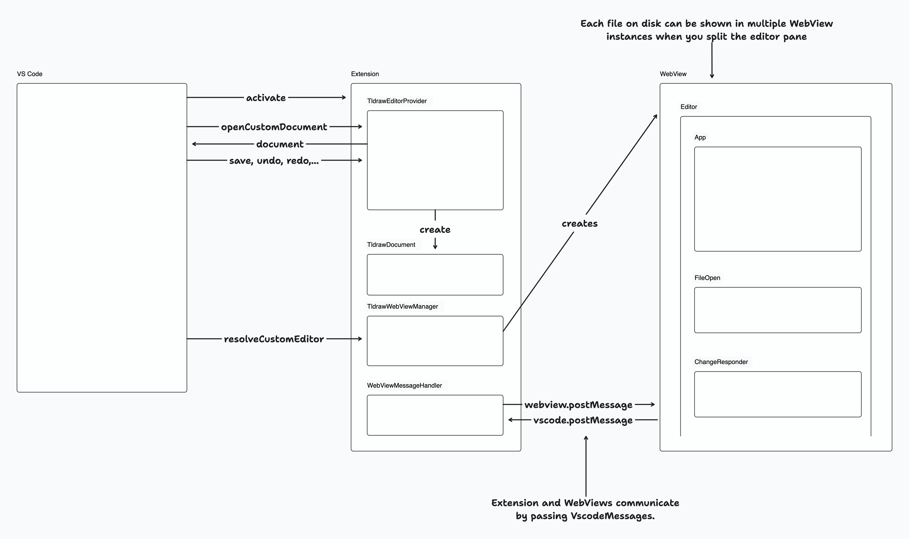

# @tldraw/vscode

This folder contains the source for the tldraw VS Code extension.

## Developing

## 1. Install dependencies

- Run `yarn` from the root folder

## 2. Start the editor

In the root folder:

- Run `yarn dev-vscode`.

This will start the development server for the `apps/vscode/editor` project and open the `apps/vscode/extension` folder in a new VS Code window.

In the `apps/vscode/extension` window, open the terminal and:

- Install dependencies (`yarn`)
- Start the VS Code debugger (`Menu > Run > Start Debugging` or by pressing `F5`). This will open another VS Code window with the extension running.

Open a `.tldr` file from the file explorer or create a new `.tldr` file from the command palette.

## 3. Debugging
You can use standard debugging techniques like `console.log`, which will be displayed in the VS Code window with the extension running. It will display logs both from the Extension and the Editor. VS Code editor with the Extension folder will show more detailed logs from the Extension project. You can also use a debugger.

The code is hot-reloaded, so the developer experience is quite nice.

## Publishing

Update the version in the `apps/vscode/extension/package.json`. Update the `apps/vscode/extension/CHANGELOG.md` with the new version number and the changes.

To publish:

- Install `vsce` globally
- Run `vsce login tldraw-org` and sign in. For this to work you need to create a [personal access token](https://code.visualstudio.com/api/working-with-extensions/publishing-extension#get-a-personal-access-token) and you also need to be added to the `tldraw-org` organization on the [Visual Studio Marketplace](https://marketplace.visualstudio.com/manage). 

In the `apps/vscode/extension` folder:
- Run `yarn package`
- Run `yarn publish`

## Project overview

The Visual Studio Code extension is made of two projects:

### 1. Extension project 
Extension project is under `apps/vscode/extension` and contains the code needed to run a VS Code Extension - it implements the required VS Code interfaces so that VS Code can call our extension and start running it.

It registers the command for generating a new `.tldr` file, custom editor for `.tldr` files, and it communicates with the WebViews that run `@tldraw/editor` (more on this later on).

VS Code Extension API offers two ways for adding [new editors](https://code.visualstudio.com/api/extension-guides/custom-editors): `CustomEditor` and `CustomTextEditor`. We are using [`CustomEditor`](https://code.visualstudio.com/api/extension-guides/custom-editors#custom-editor), even though it means we have to do a bit more work and maintain the contents of the document ourselves. This allows us to better support features like `undo`, `redo`, and `revert`, since we are in complete control of the contents of the document. 

The custom editor logic lives in `TldrawDocument`, where we handle all the required custom editor operations like reading the file from disk, saving the file, backups, reverting, etc. When a `.tldr` file is opened a new instance of a `TldrawDocument` is created and this instance then serves as the underlying document model for displaying in the VS Code editors for editing this file. You can open the same file in multiple editors, but even then only a single instance of `TldrawDocument` is created per file.

When a users opens a file a new WebView is created by the `TldrawWebviewManager` and the file's contents are sent do it. WebViews then show our editor project, which is described below.

### 2. Editor project 
Editor project is under `apps/vscode/editor`. When a file is opened a new instance of a WebView is created and we show `@tldraw/editor` this WebView.

The implementation is pretty straight forward, but there are some limitations of running `tldraw` inside a WebView, like `window.open` and `window.prompt` not being available, as well as some issues with embeds. We are using `useLocalSyncClient` to sync between different editor instances for cases when the same file is opened in multiple editors.

When users interact with tldraw we listen for changes and when changes happen we serialize the document contents and send them over to `TldrawDocument`. This makes VS Code aware of the changes and allows users to use built in features like `save`, `save as`, `undo`, `redo`, and `revert`.

### Overview of the communication between VS Code, Extension, and the Editor

VS Code actives our extension when needed - when a user opens the first `.tldr` file or when a user runs our registered command. Then, VS Code calls into `TldrawEditorProvider` to open the custom editor, which in turn creates a `TldrawDocument` instance. We read the file contents from disk and send them to the WebView, which then shows the Editor. When the user interacts with the editor we send the changes back to the Extension, which then updates the `TldrawDocument` instance. Since the instance is always kept up to date we can correctly handle user actions like `save`, `save as`, `undo`, `redo`, and `revert`.

#### References

- [VS Code Marketplace Manager](https://marketplace.visualstudio.com/manage/)
- [Web Extensions Guide](https://code.visualstudio.com/api/extension-guides/web-extensions)
  - [Test Your Web Extension](https://code.visualstudio.com/api/extension-guides/web-extensions#test-your-web-extension)
  - [Web Extension Testing](https://code.visualstudio.com/api/extension-guides/web-extensions#web-extension-tests)
  - An example custom editor that does work as a Web Extension
    - https://marketplace.visualstudio.com/items?itemName=hediet.vscode-drawio
    - https://github.com/hediet/vscode-drawio
- [VS Code Extension API/Landing Page](https://code.visualstudio.com/api)
- [Getting Started](https://code.visualstudio.com/api/get-started/your-first-extension)
- [Custom Editor API](https://code.visualstudio.com/api/extension-guides/custom-editors)
- [github.com/microsoft/vscode-extension-samples](https://github.com/microsoft/vscode-extension-samples)
- [Extensions Guide -> Webviews](https://code.visualstudio.com/api/extension-guides/webview)
- [Publishing Extensions](https://code.visualstudio.com/api/working-with-extensions/publishing-extension)
