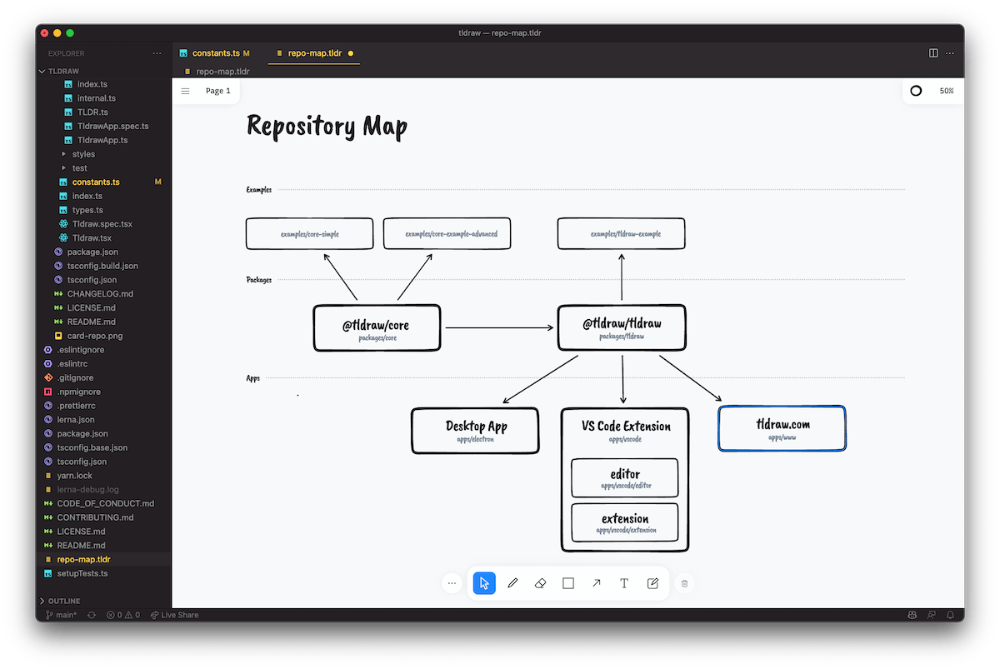
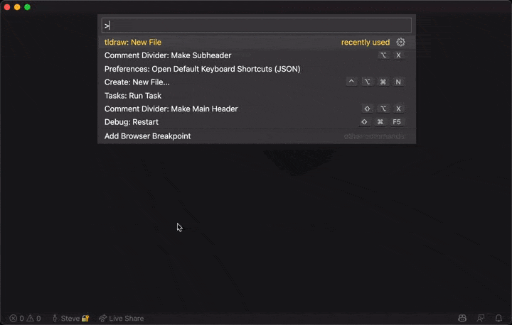

## Introduction

Create and edit diagrams using the [tldraw](https://tldraw.com/) editor, all inside of VS Code.

[tldraw](https://tldraw.com) is a free drawing and diagramming tool with a hand-drawn style and convenient features such as smart arrows, snapping, and sticky notes. With the tldraw extension for VS Code, your tldraw files can be version controlled alongside your code.

> **Tip:** The files you create or edit here can also be opened in the tldraw [web app](https://tldraw.com).

## Features

1. View, edit and save tldraw files (`.tldr`)

## Usage

- To view an existing tldraw file, open a file with the `.tldr` extension in VS Code.
- To create a new tldraw file, use the provided command: "tldraw: New tldraw File".

## Community

### Support

Need help? Please [open an issue](https://github.com/tldraw/tldraw/issues/new/choose) for support.

### Discussion

Want to connect with other devs? Visit the [Discord channel](https://discord.gg/SBBEVCA4PG).
