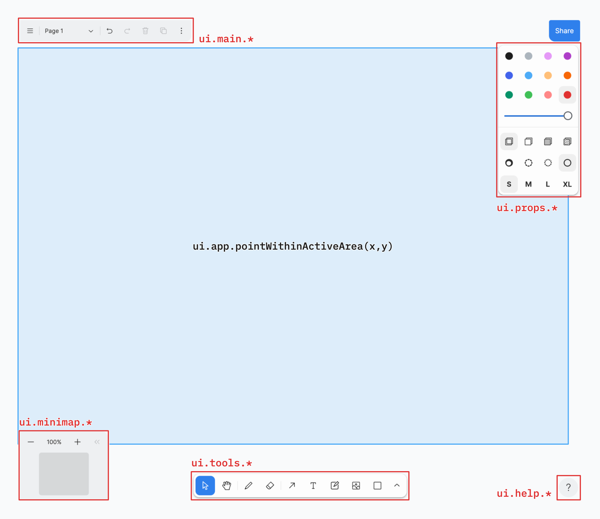

# Webdriver

This docs describes Webdriver testing within the app.

Webdriver testing can be tricky because you're sending commands to an actual browser running on either you machine or browserstack. This can be slow but it's currently the only way to test things within a wide range of browsers without emulation. This give us the best chance of having a stable app across a range of browsers without excessive manual testing

> **A note on stability**: Webdriver tests are a lot more flakey than other types of testing, the major benefit is that you can run them on real devices, so we can hopefully get a good smoke test of various real devices. You can also screenshot those devices during test runs, to check look. You however probably don't want to write too many webdriver tests, they are best placed for smoke testing and testing stuff that's very browser specific.

There is a script called `yarn e2e`, running `yarn e2e --help` will show you it's usage

```
Usage: yarn e2e <command> [options]

Commands:
  yarn e2e serve              start test server
  yarn e2e test:ci            runner for CI (github-actions)
  yarn e2e test:local         run webdriver tests locally
  yarn e2e test:browserstack  run webdriver tests on browserstack
  yarn e2e selenium:grid      start selenium grid (test linux)

Options:
  --help     Show help                                                 [boolean]
  --version  Show version number                                       [boolean]
```

To run the tests you first must start the server with

```sh
yarn e2e serve
```

You can then either test locally with

```sh
yarn e2e test:local
```

By default it'll just run the chrome tests. You can also specify other browsers to run like this

```sh
# Note edge, safari are a work in progress and will just be skipped for now.
yarn e2e test:local -b firefox,chrome,edge,safari
```

Or to test remotely via browserstack

```sh
yarn e2e test:browserstack
```

**Note**: You'll need to set `BROWSERSTACK_USER` and `BROWSERSTACK_KEY` in your environment, which you can grab from <https://automate.browserstack.com/dashboard>

There are three parts to the testing API

- `runtime` — the tldraw `App` instance in the browser window. This calls methods in the JS runtime of the app
- `ui` — methods to interacting with the apps UI elements
- `util` — some general helper methods

The `ui` is further broken up into



tldraw room for above is at <https://www.tldraw.com/v/CZw_c_7vMVkHpMcMWcMm1z8ZpN>

## Nightly tests
We run all the tests on all browsers via browserstack each night at 02:00am. You can search https://github.com/tldraw/tldraw-lite/actions/workflows/webdriver-nightly.yml for the results of the previous evenings tests

## On demand tests
To run tests on demand via github actions you can head to https://github.com/tldraw/tldraw-lite/actions/workflows/webdriver-on-demand.yml and select **run workflow** with you desired options and press the **run workflow** button

https://user-images.githubusercontent.com/235915/233660925-866d2db3-66f9-4e6c-b19a-8da597c8b512.mov

## Ongoing issues

You can see the on-going test issues in the project at <https://linear.app/tldraw/project/webdriver-tests-409b44580c4a/TLD>

Performance is a little slow remotely mostly to do with

- startup time of the browser, see <https://linear.app/tldraw/issue/TLD-1301/find-way-to-prevent-runner-from-running-if-all-tests-are-skipped-for>
- app reset/refresh time, see <https://linear.app/tldraw/issue/TLD-1293/webdriver-setup-performance>

## Writing new tests

There are target tests with the `.todo(...)` suffix, an example might be

https://github.com/tldraw/tldraw-lite/blob/7ff0dd111bb9bf9b931d53f61722842780d9793e/e2e/test/specs/shortcuts.ts#L114

The missing tests (`.todo`) follow a lot of the same patterns that already exist in the codebase. Firefox is skipped quite a lot in the test runners, this is due to issues with the app and tests, so those also need to be resolved. You can search for `FIXME` in the `./e2e` directory to find those.

## Test writing guide

Below explains the process of writing a new test. Most actions don't have anything specific for a particular browser, however most actions do have specifics per-layout and viewport size. Lets walk through and explain a very simple test, the draw shortcut.

When pressing `d` in the browser on a desktop environment we should be changing the current state to `draw.idle`. Below is the test comments in line.

```js
// These are helpers that we use in our tests to interact with our app via the browser.
import { runtime, ui } from '../helpers'

// The runner uses mocha, `env` is an addition added by mocha-ext and `it` is
// extended to support skipping of tests in certain environments.
import { describe, env, it } from '../mocha-ext'

// Always group tests, this make them easy to run in isolation by changing
// `describe(...)` to `describe.only(...)`
describe('shortcuts', () => {
    // The `env` command is used to mark groups of tests as skippable under
    // certain conditions, here we're only running these tests under desktop
    // environments. Note that is **REALLY** important we don't just wrap this
    // in a `if(FOO) {...}` block. Otherwise `.only` would break under certain
    // circumstances
    env({ device: 'desktop' }, () => {
        // We haven't written this test yet, we can mark those with a `.todo`
        // This appears as `[TODO] {test name}` in the test output.
        it.todo('select — V', async () => {
            await ui.app.setup()
            await browser.keys(['v'])
        })

        // Here is our draw shortcut test, all tests are going to be async as
        // commands are sent to the browser over HTTP
        it('draw — D', async () => {
            // We must always `setup` our app. This starts the browser (if it
            // isn't already) and does a hard reset. Note **NEVER** do this in
            // a mocha `before(...)` hook. Else you'll end up starting the browser
            // (doing heavy work) whether or not you actually run the test suite.
            // I believe this is a mocha/webdriver integration bug.
            await ui.app.setup()

            // `browser` is a global from <https://webdriver.io/docs/api/browser>
            // This is the default way to interact with the browser. There are
            // also lots of helpers in `import { ui } from '../helpers'` module.
            // Here we're instructing the browser to enter `d` to the currently
            // selected element
            await browser.keys(['d'])

            // Although we've pressed `d` we don't know how long that's going to
            // take to process in the browser. A slow environment might take
            // sometime to update the runtime. So we use `waitUntil` to wait
            // for the change. **DON'T** use `util.sleep(...)` here as this will
            // only work if the browser/env is fast and will generally slow down
            // the test runner and make things flakey.
            await browser.waitUntil(async () => {
                // `runtime` executes JS in the JS-runtime on the device. This
                // is to test for conditions to be met.
                return await runtime.isIn('draw.idle')
            })
        })
```

To run the above tests, we'd probably want to first isolate the test and `only` run a single test, or test group. Change

```diff
-        it('draw — D', async () => {
+        it.only('draw — D', async () => {
```

Now lets start the dev server and run the tests locally. In one terminal session run

```sh
yarn e2e serve
```

In another terminal session run

```sh
yarn e2e test:local
```

The test should run twice in chrome. Once in desktop chrome and once chrome mobile emulation mode. The results should look something like

```
------------------------------------------------------------------
[chrome 109.0.5414.119 mac os x #0-0] Running: chrome (v109.0.5414.119) on mac os x
[chrome 109.0.5414.119 mac os x #0-0] Session ID: 599e14341d743b938056560f3a467361
[chrome 109.0.5414.119 mac os x #0-0]
[chrome 109.0.5414.119 mac os x #0-0] » /test/specs/index.ts
[chrome 109.0.5414.119 mac os x #0-0] shortcuts
[chrome 109.0.5414.119 mac os x #0-0]    ✓ draw — D (ignored only: desktop)
[chrome 109.0.5414.119 mac os x #0-0]
[chrome 109.0.5414.119 mac os x #0-0] 1 passing (59ms)
------------------------------------------------------------------
[chrome 109.0.5414.119 mac os x #1-0] Running: chrome (v109.0.5414.119) on mac os x
[chrome 109.0.5414.119 mac os x #1-0] Session ID: 2b813d4f8793f910c1a02f771438e3f7
[chrome 109.0.5414.119 mac os x #1-0]
[chrome 109.0.5414.119 mac os x #1-0] » /test/specs/index.ts
[chrome 109.0.5414.119 mac os x #1-0] shortcuts
[chrome 109.0.5414.119 mac os x #1-0]    ✓ draw — D
[chrome 109.0.5414.119 mac os x #1-0]
[chrome 109.0.5414.119 mac os x #1-0] 1 passing (2s)


Spec Files:     2 passed, 2 total (100% completed) in 00:00:05
```

Yay, passing tests 🎉

However we're not done quite yet. Next up, we need to test them across the rest of our supported browsers. With the test server still running

```sh
yarn e2e test:browserstack
```

This will start a tunnel from browserstack to your local machine, running the tests against the local server. You can head to browserstack to see the completed test suite <https://automate.browserstack.com/dashboard/v2/builds/2d87ffb21f5466b93e6ef8b4007df995d23da7b3>

In your terminal you should see the results

```
------------------------------------------------------------------
[chrome 110.0.5481.78 windows #0-0] Running: chrome (v110.0.5481.78) on windows
[chrome 110.0.5481.78 windows #0-0] Session ID: 5123d74060f5dac19a960c50476b32007d71b758
[chrome 110.0.5481.78 windows #0-0]
[chrome 110.0.5481.78 windows #0-0] » /test/specs/index.ts
[chrome 110.0.5481.78 windows #0-0] shortcuts
[chrome 110.0.5481.78 windows #0-0]    ✓ draw — D
[chrome 110.0.5481.78 windows #0-0]
[chrome 110.0.5481.78 windows #0-0] 1 passing (36.1s)
------------------------------------------------------------------
[msedge 109.0.1518.49 WINDOWS #1-0] Running: msedge (v109.0.1518.49) on WINDOWS
[msedge 109.0.1518.49 WINDOWS #1-0] Session ID: fd44f7771955021532c16a151b2ccb7657d53cda
[msedge 109.0.1518.49 WINDOWS #1-0]
[msedge 109.0.1518.49 WINDOWS #1-0] » /test/specs/index.ts
[msedge 109.0.1518.49 WINDOWS #1-0] shortcuts
[msedge 109.0.1518.49 WINDOWS #1-0]    ✓ draw — D
[msedge 109.0.1518.49 WINDOWS #1-0]
[msedge 109.0.1518.49 WINDOWS #1-0] 1 passing (9.2s)
------------------------------------------------------------------
[firefox 109.0 WINDOWS #2-0] Running: firefox (v109.0) on WINDOWS
[firefox 109.0 WINDOWS #2-0] Session ID: b590ddccd02ee3a9f3f0ebb92c19d2c5f81421b9
[firefox 109.0 WINDOWS #2-0]
[firefox 109.0 WINDOWS #2-0] » /test/specs/index.ts
[firefox 109.0 WINDOWS #2-0] shortcuts
[firefox 109.0 WINDOWS #2-0]    ✓ draw — D
[firefox 109.0 WINDOWS #2-0]
[firefox 109.0 WINDOWS #2-0] 1 passing (14.4s)
------------------------------------------------------------------
[chrome 110.0.5481.77 MAC #3-0] Running: chrome (v110.0.5481.77) on MAC
[chrome 110.0.5481.77 MAC #3-0] Session ID: 12d8c60cfb3a20b516b300191e12c4d71952d607
[chrome 110.0.5481.77 MAC #3-0]
[chrome 110.0.5481.77 MAC #3-0] » /test/specs/index.ts
[chrome 110.0.5481.77 MAC #3-0] shortcuts
[chrome 110.0.5481.77 MAC #3-0]    ✓ draw — D
[chrome 110.0.5481.77 MAC #3-0]
[chrome 110.0.5481.77 MAC #3-0] 1 passing (10.9s)
------------------------------------------------------------------
[firefox 109.0 MAC #4-0] Running: firefox (v109.0) on MAC
[firefox 109.0 MAC #4-0] Session ID: be2fae1429977f192be311c7a1f6a177c0ff6170
[firefox 109.0 MAC #4-0]
[firefox 109.0 MAC #4-0] » /test/specs/index.ts
[firefox 109.0 MAC #4-0] shortcuts
[firefox 109.0 MAC #4-0]    ✓ draw — D
[firefox 109.0 MAC #4-0]
[firefox 109.0 MAC #4-0] 1 passing (9.5s)
------------------------------------------------------------------
[msedge 109.0.1518.49 MAC #5-0] Running: msedge (v109.0.1518.49) on MAC
[msedge 109.0.1518.49 MAC #5-0] Session ID: 0e59617ae8ac7e5403270c204e1108aa0b2a6c62
[msedge 109.0.1518.49 MAC #5-0]
[msedge 109.0.1518.49 MAC #5-0] » /test/specs/index.ts
[msedge 109.0.1518.49 MAC #5-0] shortcuts
[msedge 109.0.1518.49 MAC #5-0]    ✓ draw — D
[msedge 109.0.1518.49 MAC #5-0]
[msedge 109.0.1518.49 MAC #5-0] 1 passing (8s)
------------------------------------------------------------------
[2B111FDH2007PR Android 13 #6-0] Running: 2B111FDH2007PR on Android 13 executing chrome
[2B111FDH2007PR Android 13 #6-0] Session ID: 4317967dd4e85cff839a7965a34707a2c839e748
[2B111FDH2007PR Android 13 #6-0]
[2B111FDH2007PR Android 13 #6-0] » /test/specs/index.ts
[2B111FDH2007PR Android 13 #6-0] shortcuts
[2B111FDH2007PR Android 13 #6-0]    ✓ draw — D (ignored only: desktop)
[2B111FDH2007PR Android 13 #6-0]
[2B111FDH2007PR Android 13 #6-0] 1 passing (1.6s)
------------------------------------------------------------------
[R5CR10PDY5Y Android 11 #7-0] Running: R5CR10PDY5Y on Android 11
[R5CR10PDY5Y Android 11 #7-0] Session ID: 696e16707b7d9bfdcfc04d3dca08e4579a91af18
[R5CR10PDY5Y Android 11 #7-0]
[R5CR10PDY5Y Android 11 #7-0] » /test/specs/index.ts
[R5CR10PDY5Y Android 11 #7-0] shortcuts
[R5CR10PDY5Y Android 11 #7-0]    ✓ draw — D (ignored only: desktop)
[R5CR10PDY5Y Android 11 #7-0]
[R5CR10PDY5Y Android 11 #7-0] 1 passing (1.8s)
------------------------------------------------------------------
[R3CR909M44J Android 11 #8-0] Running: R3CR909M44J on Android 11 executing chrome
[R3CR909M44J Android 11 #8-0] Session ID: 797cf525cd07f287281a2051075e0b5e5edc9fd2
[R3CR909M44J Android 11 #8-0]
[R3CR909M44J Android 11 #8-0] » /test/specs/index.ts
[R3CR909M44J Android 11 #8-0] shortcuts
[R3CR909M44J Android 11 #8-0]    ✓ draw — D (ignored only: desktop)
[R3CR909M44J Android 11 #8-0]
[R3CR909M44J Android 11 #8-0] 1 passing (2.1s)


Spec Files:	 9 passed, 9 total (100% completed) in 00:03:51
```

Now you can remove the `.only` and open a PR and rejoice in your new found skills.

```diff
-        it.only('draw — D', async () => {
+        it('draw — D', async () => {
```

Existing tests are a good guide for writing more advance tests, hopefully this should give you a start 🤞


## Notes

### `msedgedriver`
You might notice that `msedgedriver` on version 91, and hasn't been updated in a while. 

```
"msedgedriver": "^91.0.0",
```

This module isn't actually used but is required for `wdio-edgedriver-service` to start where we pass a custom path via the `edgedriverCustomPath` option.

### `safaridriver`
Locally safari webdriver tests are currently somewhat buggy, there appear to be some tests that don't complete. Please take on this task if you have time 🙂 


## Experimental
You can now also run _linux_ tests on _macos_. To do this start up a selenium grid with. Note, you **must** have `docker` installed locally.

```sh
yarn e2e selenium:grid
```

Then run

```sh
yarn e2e test:local --os linux -b firefox
```

**Note**: Currently only `firefox` is supported. You can hit <http://localhost:7900/?autoconnect=1&resize=scale&password=secret> to see a VNC of the app runing in a docker container.