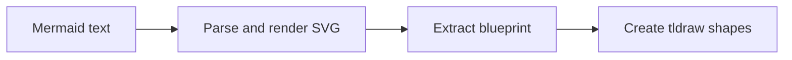

# @tldraw/mermaid

Convert [Mermaid](https://mermaid.js.org/) diagram syntax into native, editable tldraw shapes.

Instead of rendering a static SVG, `@tldraw/mermaid` parses Mermaid text and creates real geo shapes, arrows, frames, and groups on the tldraw canvas — so users can move, resize, restyle, and connect them like any other shape.

## Installation

```bash
npm i @tldraw/mermaid
```

> **Peer dependency:** this package requires `tldraw` to be installed in your project.

## Quick start

```tsx
import { createMermaidDiagram } from '@tldraw/mermaid'

// Inside a component or callback with access to the editor:
await createMermaidDiagram(
	editor,
	`
  flowchart TD
    A[Start] --> B{Decision}
    B -->|Yes| C[Do something]
    B -->|No| D[Do something else]
`
)
```

By default, shapes are centered on the viewport. You can control placement with `blueprintRender`:

```tsx
// Center the diagram on a specific point (default behavior)
await createMermaidDiagram(editor, diagramText, {
	blueprintRender: {
		position: { x: 500, y: 300 },
		centerOnPosition: true,
	},
})

// Place the diagram's top-left corner at the given point
await createMermaidDiagram(editor, diagramText, {
	blueprintRender: {
		position: { x: 0, y: 0 },
		centerOnPosition: false,
	},
})
```

When `centerOnPosition` is `true` (the default), the diagram's center aligns with the given position. When `false`, the diagram's top-left corner aligns with it instead. If no `position` is provided, the diagram uses the viewport center — or the cursor position if the user has "paste at cursor" mode enabled.

## Supported diagram types

| Diagram type     | Mermaid keyword      | What you get                                                        |
| ---------------- | -------------------- | ------------------------------------------------------------------- |
| Flowchart        | `flowchart`, `graph` | Geo shapes, arrows, subgraph frames                                 |
| Sequence diagram | `sequenceDiagram`    | Actor shapes, lifelines, signal arrows, fragment frames             |
| State diagram    | `stateDiagram-v2`    | State shapes, transitions, compound state frames, fork/join, choice |

Unsupported diagram types (pie, gantt, class, ER, etc.) can be handled with the `onUnsupportedDiagram` callback — for example, to fall back to SVG import:

```tsx
await createMermaidDiagram(editor, text, {
	onUnsupportedDiagram(svgString) {
		editor.putExternalContent({ type: 'svg-text', text: svgString })
	},
})
```

## API

### `createMermaidDiagram(editor, text, options?)`

Parses Mermaid text, extracts layout from the rendered SVG, builds a blueprint, and creates tldraw shapes.

- **`editor`** — a tldraw `Editor` instance.
- **`text`** — Mermaid diagram source text.
- **`options`** — optional `MermaidDiagramOptions`:
  - `mermaidConfig` — Mermaid configuration overrides (theme, spacing, etc.).
  - `blueprintRender` — positioning options (`position`, `centerOnPosition`).
  - `onUnsupportedDiagram(svg)` — callback when the diagram type isn't natively supported.

Throws `MermaidDiagramError` on parse failure or unsupported diagram type (if no callback is provided).

### `renderBlueprint(editor, blueprint, opts?)`

Renders a pre-built `DiagramMermaidBlueprint` into the editor. Useful if you want to construct or modify a blueprint programmatically before rendering.

### `MermaidDiagramError`

Error class with `type: 'parse' | 'unsupported'` and `diagramType` properties.

### Types

- **`DiagramMermaidBlueprint`** — intermediate representation: `{ nodes, edges, lines?, groups? }`.
- **`MermaidBlueprintGeoNode`** — a shape node with position, size, geo type, label, colors, and optional `parentId`.
- **`MermaidBlueprintEdge`** — an arrow with start/end node IDs, bend, arrowheads, dash style, and anchor positions.
- **`MermaidBlueprintLineNode`** — a vertical or horizontal line (used for sequence diagram lifelines).
- **`BlueprintRenderingOptions`** — position and centering options for `renderBlueprint`.

## How it works

The conversion happens in three stages:



1. **Parse and render** — Mermaid parses the text and renders an SVG into an offscreen DOM element, giving us accurate layout positions via `getBBox()`.
2. **Extract blueprint** — a diagram-specific converter reads positions from the SVG and semantic data from Mermaid's internal database, producing a `DiagramMermaidBlueprint`.
3. **Create shapes** — `renderBlueprint` converts the blueprint into tldraw geo shapes, arrows, lines, frames, and groups.

## Example: paste handler

A common integration is converting Mermaid text on paste. Here's a React component that registers itself as a text content handler — based on the pattern used on [tldraw.com](https://github.com/tldraw/tldraw/blob/main/apps/dotcom/client/src/components/SneakyMermaidHandler/SneakyMermaidHandler.tsx):

```tsx
import { useEffect } from 'react'
import { defaultHandleExternalTextContent, useEditor } from 'tldraw'

const MERMAID_KEYWORD =
	/^\s*(flowchart|graph|sequenceDiagram|stateDiagram|classDiagram|erDiagram|gantt|pie|gitGraph|mindmap)/

export function MermaidPasteHandler() {
	const editor = useEditor()

	useEffect(() => {
		editor.registerExternalContentHandler('text', async (content) => {
			if (!MERMAID_KEYWORD.test(content.text)) {
				await defaultHandleExternalTextContent(editor, content)
				return
			}

			try {
				const { createMermaidDiagram } = await import('@tldraw/mermaid')
				await createMermaidDiagram(editor, content.text, {
					async onUnsupportedDiagram(svgString) {
						await editor.putExternalContent({ type: 'svg-text', text: svgString })
					},
				})
			} catch {
				await defaultHandleExternalTextContent(editor, content)
			}
		})
	}, [editor])

	return null
}
```

Drop `<MermaidPasteHandler />` inside your `<Tldraw>` component and users can paste Mermaid text directly onto the canvas.

The regex above is a simplified check. On tldraw.com the detection is handled by [`simpleMermaidStringTest`](https://github.com/tldraw/tldraw/blob/main/apps/dotcom/client/src/components/SneakyMermaidHandler/simpleMermaidStringTest.ts), which also strips YAML frontmatter (`---...---`), `%%{...}%%` directives, and `%%` comments before testing for the diagram keyword — making it more robust for real-world pasted content.

## Lazy loading

The `mermaid` dependency is roughly 2 MB. The paste handler above already lazy-loads with `await import('@tldraw/mermaid')` — the package is only fetched when the pasted text matches a Mermaid keyword. For your own integration, the same pattern applies: pre-screen with a lightweight regex, then dynamic-import the package only when needed.

## Examples

See the [Mermaid diagrams example](https://github.com/tldraw/tldraw/tree/main/apps/examples/src/examples/use-cases/hundred-mermaids) in the examples app for a runnable demo that renders many diagram types at once. Run it locally with `yarn dev` from the repo root and visit `localhost:5420`.

## License

This project is part of the tldraw SDK. It is provided under the [tldraw SDK license](https://github.com/tldraw/tldraw/blob/main/LICENSE.md).

## Trademarks

Copyright (c) 2024-present tldraw Inc. The tldraw name and logo are trademarks of tldraw. Please see our [trademark guidelines](https://github.com/tldraw/tldraw/blob/main/TRADEMARKS.md) for info on acceptable usage.

## Distributions

You can find tldraw on npm [here](https://www.npmjs.com/package/@tldraw/tldraw?activeTab=versions).

## Contribution

Please see our [contributing guide](https://github.com/tldraw/tldraw/blob/main/CONTRIBUTING.md). Found a bug? Please [submit an issue](https://github.com/tldraw/tldraw/issues/new).

## Community

Have questions, comments or feedback? [Join our discord](https://discord.tldraw.com/?utm_source=github&utm_medium=readme&utm_campaign=sociallink). For the latest news and release notes, visit [tldraw.dev](https://tldraw.dev).

## Contact

Find us on Twitter/X at [@tldraw](https://twitter.com/tldraw).
