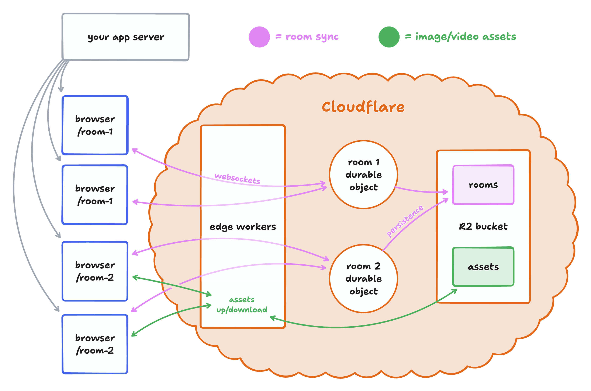

# tldraw on cloudflare durable objects

This repo contains a complete example of tldraw sync ready to deploy on cloudflare.

- The client itself can be deployed wherever you like.
- The server is on [Cloudflare Workers](https://developers.cloudflare.com/workers/).
- Each whiteboard is synced via
  [WebSockets](https://developer.mozilla.org/en-US/docs/Web/API/WebSockets_API) to a [Cloudflare
  Durable Object](https://developers.cloudflare.com/durable-objects/).
- Whiteboards and any uploaded images/videos are stored in a [Cloudflare
  R2](https://developers.cloudflare.com/r2/) bucket.
- URL metadata unfurling for bookmarks shapes is also supported.

This is a simplified version of the system that powers multiplayer collaboration for hundreds of
thousands of rooms & users on www.tldraw.com. Because durable objects effectively create a mini
server instance for every single active room, we've never needed to worry about scale. Cloudflare
handles the tricky infrastructure work of ensuring there's only ever one instance of each room, and
making sure that every user gets connected to that instance. We've found that with this approach,
each room is able to handle about 30 simultaneous collaborators.

## Overview

When a user opens a room, they connect via Workers to a durable object. Each durable object is like
its own miniature server. There's only ever one for each room, and all the users of that room
connect to it. When a user makes a change to the drawing, it's sent via a websocket connection to
the durable object for that room. The durable object applies the change to its in-memory copy of the
document, and broadcasts the change via websockets to all other connected clients. On a regular
schedule, the durable object persists its contents to an R2 bucket. When the last client leaves the
room, the durable object will shut down.

Static assets like images and videos are too big to be synced via websockets and a durable object.
Instead, they're uploaded to workers which store them in the same R2 bucket as the rooms. When
they're downloaded, they're cached on cloudflare's edge network to reduce costs and make serving
them faster.

## Development

To install dependencies, run `yarn`. To start a local development server, run `yarn dev`. This will
start a [`vite`](https://vitejs.dev/) dev server for the frontend of your application, and a
[`wrangler`](https://developers.cloudflare.com/workers/wrangler/) dev server for your workers
backend.

The client-side code lives in [`client`](./client/). The sync integration with tldraw is in
[`client/App.tsx`](./client/App.tsx). The worker lives [`worker`](./worker/), and is split across
several files:

- **[`worker/worker.ts`](./worker/worker.ts):** the main entrypoint to the worker, defining each
  route available.
- **[`worker/TldrawDurableObject.ts`](./worker/TldrawDurableObject.ts):** the sync durable object.
  An instance of this is created for every active room. This exposes a
  [`TLSocketRoom`](https://tldraw.dev/reference/sync-core/TLSocketRoom) over websockets, and
  periodically saves room data to R2.
- **[`worker/assetUploads.ts](./worker/assetUploads.ts):** uploads, downloads, and caching for
  static assets like images and videos.
- **[`worker/bookmarkUnfurling.ts`](./worker/bookmarkUnfurling.ts):** extract URL metadata for bookmark shapes.

## Deployment

To deploy this example, you'll need to create a cloudflare account and create an R2 bucket to store
your data. Update `bucket_name = 'tldraw-content'` in [`wrangler.toml`](./wrangler.toml) with the
name of your new bucket.

Run `wrangler deploy` to deploy your backend. This should give you a workers.dev URL, but you can
also [configure a custom
domain](https://developers.cloudflare.com/workers/configuration/routing/custom-domains/).

Finally, deploy your client HTML & JavaScript. Create a production build with
`TLDRAW_WORKER_URL=your.workers.domain.com yarn build`. Publish the resulting build (in `dist/`) on
a host of your choosing - we use [Vercel](https://vercel.com).

When you visit your published client, it should connect to your cloudflare workers domain and sync
your document across devices.
